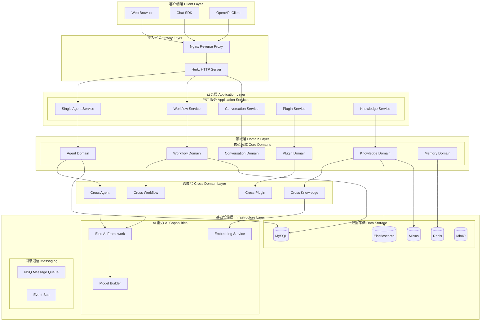
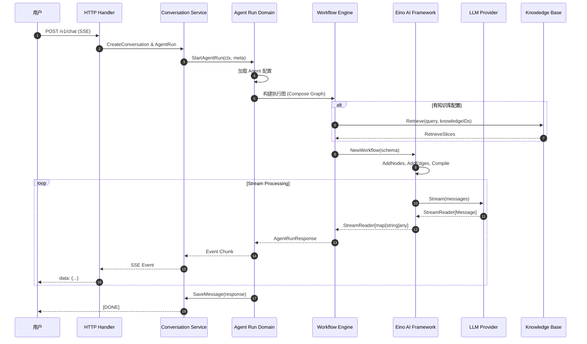
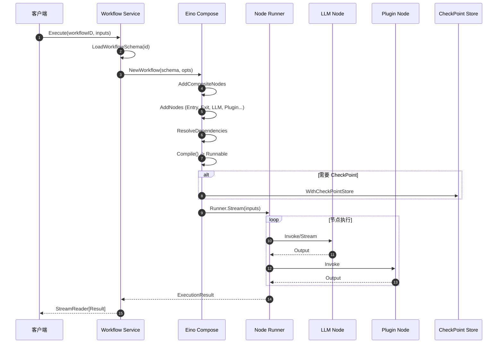

# Coze Studio 系统架构与实现深度分析

> 本文档基于对 Coze Studio 开源项目源码的深度分析，旨在揭示其系统架构、设计模式和核心实现逻辑。

## 1. 项目概述与核心价值

### 1.1 核心解决痛点

Coze Studio 是由字节跳动开源的一站式 AI Agent 开发平台，核心解决以下问题：

- **降低 AI Agent 开发门槛**：提供可视化、低代码/零代码的智能体构建环境
- **统一的模型抽象**：集成 OpenAI、Volcengine Ark、Claude、Gemini、Qwen、DeepSeek、Ollama 等多种大语言模型
- **完整的工作流编排**：支持复杂业务逻辑的可视化编排与调试
- **企业级 RAG 方案**：提供知识库、向量检索、重排序等完整的检索增强生成能力

### 1.2 适用场景

| 场景类型 | 具体应用 |
|---------|---------|
| 智能客服 | 基于知识库的自动问答系统 |
| 内容创作 | AI 辅助写作、文档生成 |
| 数据分析 | NL2SQL 自然语言查询数据库 |
| 流程自动化 | 复杂业务流程的智能编排 |
| 企业应用集成 | 通过插件系统对接第三方服务 |

### 1.3 技术栈总结

```
┌─────────────────────────────────────────────────────────────────────┐
│                           Frontend                                   │
│  React 18 + TypeScript + Rush.js + Rsbuild + Zustand + Semi Design  │
│  FlowGram (工作流画布引擎) + Tailwind CSS                            │
├─────────────────────────────────────────────────────────────────────┤
│                           Backend                                    │
│  Go 1.24 + Hertz (HTTP Framework) + GORM + Eino (AI Framework)      │
│  DDD 架构 + 微服务设计                                               │
├─────────────────────────────────────────────────────────────────────┤
│                        Infrastructure                                │
│  MySQL 8.4 | Redis 8.0 | Elasticsearch 8.18 | Milvus 2.5 | MinIO    │
│  NSQ (消息队列) | etcd 3.5 (配置中心)                                │
└─────────────────────────────────────────────────────────────────────┘
```

---

## 2. 系统架构设计

### 2.1 顶层架构图 (Mermaid)



### 2.2 核心模块说明

#### 后端模块结构

| 模块路径 | 模块名称 | 核心职责 | 关键类/文件 |
|:--------|:--------|:--------|:-----------|
| `backend/api/` | API 层 | HTTP 路由处理、请求/响应转换、中间件 | `router/register.go`, `middleware/*.go` |
| `backend/application/` | 应用服务层 | 业务用例编排、跨域协调 | `singleagent/`, `workflow/`, `conversation/` |
| `backend/domain/` | 领域层 | 核心业务逻辑、领域模型、仓储接口 | `workflow/`, `conversation/`, `knowledge/` |
| `backend/crossdomain/` | 跨域层 | 领域间通信契约、依赖倒置 | `agent/contract.go`, `workflow/contract.go` |
| `backend/infra/` | 基础设施层 | 数据访问、外部服务集成 | `orm/`, `es/`, `eventbus/`, `storage/` |
| `backend/bizpkg/` | 业务公共包 | 模型配置、LLM 构建器 | `config/modelmgr/`, `llm/modelbuilder/` |
| `backend/pkg/` | 工具包 | 通用工具、错误处理、日志 | `errorx/`, `logs/`, `safego/` |

#### 前端模块结构 (Rush.js Monorepo)

| 层级 | 模块路径 | 核心职责 | 包数量 |
|:-----|:--------|:--------|:-------|
| Level-1 | `packages/arch/` | 核心架构基础设施 (API、i18n、配置) | ~40 |
| Level-2 | `packages/common/` | 公共组件、业务工具 | ~50 |
| Level-3 | `packages/workflow/`, `packages/agent-ide/`, `packages/studio/` | 功能域模块 | ~80 |
| Level-4 | `apps/coze-studio/` | 主应用入口 | 1 |

---

## 3. 关键流程分析

### 3.1 Agent 对话执行流程 (Sequence Diagram)



### 3.2 工作流执行流程



---

## 4. 源码级设计亮点

### 4.1 设计模式 A：依赖倒置与跨域通信

**代码路径**: `backend/crossdomain/`

Coze Studio 采用 **依赖倒置原则 (DIP)** 实现领域间解耦。每个跨域模块包含：
- `contract.go`: 定义服务接口
- `impl/`: 接口实现
- `model/`: 跨域数据模型

```go
// backend/crossdomain/workflow/contract.go
package workflow

type Service interface {
    GetWorkflow(ctx context.Context, id int64) (*model.Workflow, error)
    Execute(ctx context.Context, req *model.ExecuteRequest) (*model.ExecuteResult, error)
}

var defaultSVC Service

func SetDefaultSVC(svc Service) { defaultSVC = svc }
func DefaultSVC() Service       { return defaultSVC }
```

**实现原理**：
1. 应用层初始化时注入具体实现
2. 各领域通过 `DefaultSVC()` 获取服务实例
3. 避免领域间的直接依赖，支持 Mock 测试

### 4.2 设计模式 B：Eino Compose 图执行引擎

**代码路径**: `backend/domain/workflow/internal/compose/workflow.go`

基于字节跳动开源的 [Eino](https://github.com/cloudwego/eino) 框架实现的工作流执行引擎，核心特点：

```go
// 工作流构建
func NewWorkflow(ctx context.Context, sc *schema.WorkflowSchema, opts ...WorkflowOption) (*Workflow, error) {
    wf := &Workflow{
        workflow: compose.NewWorkflow[map[string]any, map[string]any](
            compose.WithGenLocalState(GenState()),
        ),
    }
    
    // 1. 添加复合节点（循环、分支等）
    for _, cNode := range sc.GetCompositeNodes() {
        wf.AddCompositeNode(ctx, cNode)
    }
    
    // 2. 添加普通节点（LLM、Plugin、Code等）
    for _, ns := range sc.Nodes {
        wf.AddNode(ctx, ns)
    }
    
    // 3. 编译为可执行图
    r, err := wf.Compile(ctx, compileOpts...)
    wf.Runner = r
    
    return wf, nil
}
```

**核心能力**：
- **DAG 执行**：基于有向无环图的节点依赖解析
- **流式处理**：支持 `StreamReader` 实现 SSE 流式响应
- **CheckPoint**：支持断点续跑，基于 Redis 存储执行状态
- **嵌套工作流**：支持工作流作为子节点的递归调用

### 4.3 设计模式 C：适配器模式 (Adapter Pattern)

**代码路径**: `frontend/packages/*/adapter/`

前端采用大量适配器包实现业务逻辑与 UI 的解耦：

```
@coze-workflow/nodes          # 节点抽象定义
@coze-workflow/nodes-adapter  # 节点具体实现适配

@coze-foundation/account-base    # 账户基础接口
@coze-foundation/account-adapter # 账户实现适配
```

**优势**：
- 支持多版本/多平台适配
- 便于单元测试 Mock
- 符合开闭原则

### 4.4 设计模式 D：事件驱动架构

**代码路径**: `backend/infra/eventbus/`

```go
// 支持多种消息队列后端
backend/infra/eventbus/impl/
├── kafka/    # Kafka 实现
├── nsq/      # NSQ 实现 (默认)
├── nats/     # NATS 实现
├── pulsar/   # Pulsar 实现
└── rmq/      # RocketMQ 实现
```

**应用场景**：
- 资源变更事件 (Resource Event Bus)
- 项目/应用事件 (App Event Bus)
- 知识库处理事件 (Knowledge Event Bus)

### 4.5 LLM 节点的 ReAct Agent 集成

**代码路径**: `backend/domain/workflow/internal/nodes/llm/llm.go`

```go
// LLM 节点支持 Function Calling (工具调用)
if len(tools) > 0 {
    m, ok := modelWithInfo.(model.ToolCallingChatModel)
    
    reactConfig := react.AgentConfig{
        ToolCallingModel: m,
        ToolsConfig:      compose.ToolsNodeConfig{Tools: tools},
        ModelNodeName:    agentModelName,
        GraphName:        reactGraphName,
    }
    
    // 使用 Eino 的 ReAct Agent 实现工具调用循环
    reactAgent, err := react.NewAgent(ctx, &reactConfig)
    agentNode, opts := reactAgent.ExportGraph()
    _ = g.AddGraphNode(llmNodeKey, agentNode, opts...)
}
```

**支持的工具类型**：
- **Workflow as Tool**: 工作流作为工具被 LLM 调用
- **Plugin Tool**: 第三方插件 API
- **Knowledge Tool**: 知识库检索增强

---

## 5. 数据流向分析

### 5.1 请求处理流程

```
┌───────────┐    ┌───────────┐    ┌───────────────┐    ┌──────────────┐
│  Client   │───▶│   Nginx   │───▶│ Hertz Server  │───▶│  Middleware  │
└───────────┘    └───────────┘    └───────────────┘    └──────────────┘
                                                              │
                 ┌────────────────────────────────────────────┤
                 ▼                                            ▼
         ┌──────────────┐                           ┌─────────────────┐
         │ Context Cache│                           │  Session Auth   │
         │   Middleware │                           │   Middleware    │
         └──────────────┘                           └─────────────────┘
                 │                                            │
                 └─────────────────┬──────────────────────────┘
                                   ▼
                         ┌─────────────────┐
                         │  Router Handler │
                         └─────────────────┘
                                   │
                 ┌─────────────────┼─────────────────┐
                 ▼                 ▼                 ▼
         ┌──────────────┐  ┌──────────────┐  ┌──────────────┐
         │ Application  │  │ Application  │  │ Application  │
         │   Agent      │  │  Workflow    │  │ Conversation │
         └──────────────┘  └──────────────┘  └──────────────┘
                 │                 │                 │
                 └─────────────────┼─────────────────┘
                                   ▼
                         ┌─────────────────┐
                         │  Domain Layer   │
                         └─────────────────┘
                                   │
         ┌─────────────────────────┼─────────────────────────┐
         ▼                         ▼                         ▼
  ┌──────────────┐         ┌──────────────┐         ┌──────────────┐
  │    MySQL     │         │    Redis     │         │    Milvus    │
  │  (持久化)    │         │   (缓存)     │         │  (向量存储)  │
  └──────────────┘         └──────────────┘         └──────────────┘
```

### 5.2 知识库检索流程

```
User Query
    │
    ▼
┌───────────────────┐
│   Query Rewrite   │  ← Eino Messages2Query
│   (可选)          │
└───────────────────┘
    │
    ▼
┌───────────────────┐
│  Hybrid Search    │
│  ├─ Semantic     │  ← Milvus 向量检索
│  └─ FullText     │  ← Elasticsearch 全文检索
└───────────────────┘
    │
    ▼
┌───────────────────┐
│    Reranker       │  ← 重排序优化
│    (可选)         │
└───────────────────┘
    │
    ▼
┌───────────────────┐
│  RAG Augmented    │
│     Prompt        │
└───────────────────┘
    │
    ▼
   LLM Response
```

---

## 6. 总结与启示

### 6.1 架构设计最值得借鉴的 3 个点

1. **分层清晰的 DDD 架构**
   - `api` → `application` → `domain` → `infra` 四层分明
   - `crossdomain` 层通过接口实现领域解耦
   - 依赖倒置原则贯穿始终，便于测试和扩展

2. **基于 Eino 的可组合 AI 工作流引擎**
   - 使用 DAG 图结构描述工作流
   - 支持流式处理、断点续跑、嵌套执行
   - 节点类型可扩展 (LLM、Plugin、Code、Knowledge 等)

3. **前端 Monorepo 的分层治理**
   - 135+ 包按 Level 1-4 分层管理
   - 严格的依赖方向控制 (高层只能依赖低层)
   - Adapter 模式实现业务与实现的解耦

### 6.2 技术选型亮点

| 技术选择 | 优势分析 |
|---------|---------|
| Hertz HTTP | 字节开源高性能框架，适合高并发场景 |
| Eino AI | 统一的 LLM 抽象，支持多模型供应商 |
| Rush.js + Rsbuild | 高性能前端构建，适合大型 Monorepo |
| Milvus + ES | 混合检索能力，兼顾语义和关键词 |
| NSQ | 轻量级消息队列，适合中小规模部署 |

### 6.3 潜在的改进方向

1. **可观测性增强**：集成 OpenTelemetry 实现分布式追踪
2. **多租户支持**：当前为单租户设计，企业级需要租户隔离
3. **工作流版本管理**：支持工作流的版本回滚和 A/B 测试
4. **插件沙箱隔离**：代码节点的安全执行环境增强

---

## 附录：核心代码文件索引

| 功能模块 | 关键文件 |
|---------|---------|
| 应用初始化 | `backend/main.go`, `backend/application/application.go` |
| 工作流引擎 | `backend/domain/workflow/internal/compose/workflow.go` |
| LLM 节点 | `backend/domain/workflow/internal/nodes/llm/llm.go` |
| Agent 执行 | `backend/domain/conversation/agentrun/service/agent_run.go` |
| 知识库检索 | `backend/domain/knowledge/` |
| 基础设施 | `backend/application/base/appinfra/app_infra.go` |
| 前端应用 | `frontend/apps/coze-studio/` |
| 工作流画布 | `frontend/packages/workflow/fabric-canvas/` |

---

*文档生成日期: 2025-12-11*
*分析版本: Coze Studio Open Source Edition*

