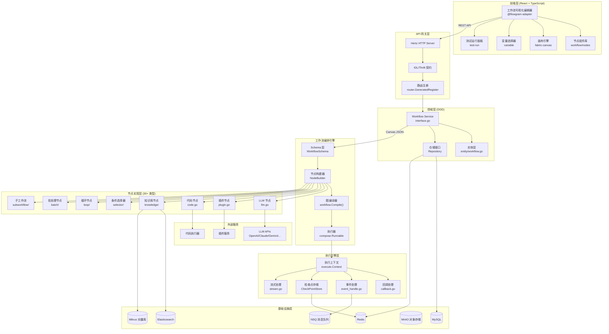
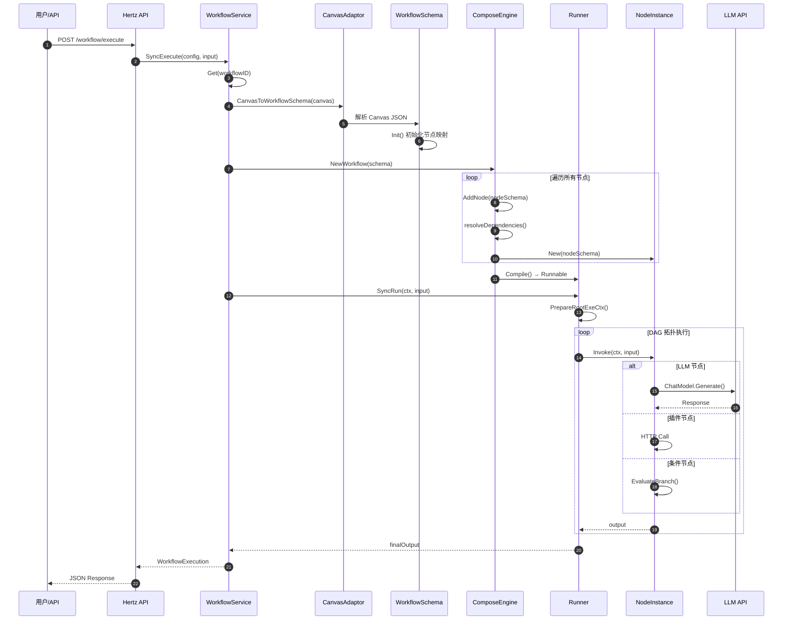
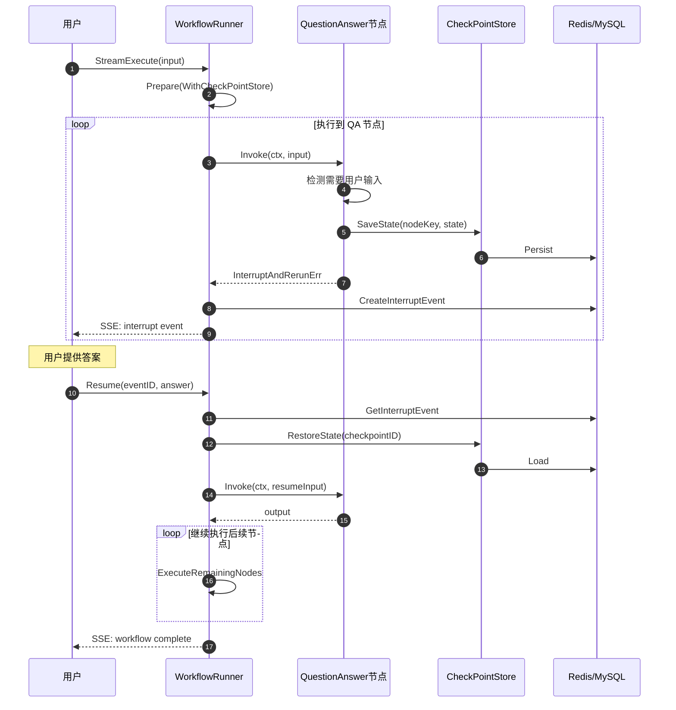
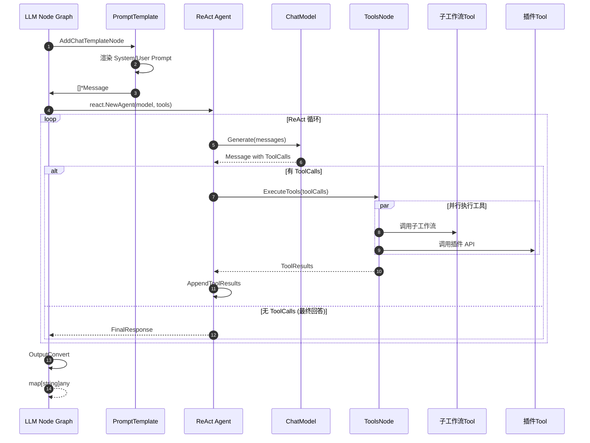

# Coze Studio Workflow 工作流引擎 — 系统架构与实现深度分析

## 1. 项目概述与核心价值

### 1.1 核心解决痛点

**Coze Studio Workflow** 是一个面向 AI Agent 的可视化工作流编排引擎，解决以下核心问题：

1. **低代码 AI 应用构建**：允许非技术用户通过拖拽节点构建复杂的 AI 工作流，降低 AI Agent 开发门槛
2. **多模型编排与调用**：统一接入 OpenAI、Claude、Gemini、Ollama 等多种 LLM，提供标准化的模型调用接口
3. **复杂业务逻辑支持**：通过批处理、循环、条件分支等控制流节点，支持复杂业务场景
4. **知识增强与工具调用**：集成知识库检索、插件调用、子工作流嵌套等能力，增强 AI Agent 的推理能力
5. **长时任务与中断恢复**：通过检查点机制支持人机交互、长时任务暂停与恢复

### 1.2 适用场景

| 场景 | 描述 |
|------|------|
| **智能客服** | 构建多轮对话 Agent，集成知识库、工具调用 |
| **数据处理** | 批量数据转换、数据库 CRUD、HTTP 请求编排 |
| **内容生成** | 多步骤内容生成管道，支持流式输出 |
| **决策系统** | 意图识别 + 条件分支 + 多模型协作 |
| **自动化任务** | 定时触发、事件驱动的自动化工作流 |

---

## 2. 系统架构设计

### 2.1 顶层架构图 (Mermaid)



### 2.2 核心模块说明

| 模块路径 | 模块名称 | 核心职责 | 关键类/文件 |
|:---------|:---------|:---------|:------------|
| `backend/domain/workflow/` | 工作流领域 | 工作流 CRUD、执行入口 | `interface.go`, `service/executable_impl.go` |
| `backend/domain/workflow/internal/schema/` | Schema 层 | 工作流图结构定义 | `workflow_schema.go`, `node_schema.go` |
| `backend/domain/workflow/internal/compose/` | 编排引擎 | DAG 构建与编译 | `workflow.go`, `node_builder.go` |
| `backend/domain/workflow/internal/nodes/` | 节点实现 | 30+ 种节点的业务逻辑 | `llm/`, `plugin/`, `selector/`, `loop/` |
| `backend/domain/workflow/internal/execute/` | 执行引擎 | 运行时上下文与事件处理 | `context.go`, `callback.go`, `event_handle.go` |
| `backend/domain/workflow/entity/` | 实体定义 | 工作流、节点元数据 | `workflow.go`, `node_meta.go` |
| `frontend/packages/workflow/base/` | 前端基础层 | 类型定义、工具函数 | `types/`, `utils/` |
| `frontend/packages/workflow/nodes/` | 前端节点定义 | 节点元数据与校验 | `typings.ts`, `service.ts` |
| `frontend/packages/workflow/playground/` | 工作流编辑器 | 完整编辑器 UI | 2300+ 文件 |

---

## 3. 关键流程分析 (Sequence Diagram)

### 3.1 工作流执行主流程



### 3.2 流式执行与中断恢复流程



### 3.3 LLM 节点 Function Calling 流程



---

## 4. 源码级设计亮点

### 4.1 节点抽象与多态设计

**设计模式**：策略模式 + 适配器模式 + 工厂模式

```go
// backend/domain/workflow/internal/nodes/node.go
// 核心接口定义 - 策略模式
type InvokableNode interface {
    Invoke(ctx context.Context, input map[string]any) (output map[string]any, err error)
}

type StreamableNodeWOpt interface {
    Stream(ctx context.Context, in map[string]any, opts ...NodeOption) (*schema.StreamReader[map[string]any], error)
}

type TransformableNode interface {
    Transform(ctx context.Context, in *schema.StreamReader[map[string]any]) (*schema.StreamReader[map[string]any], error)
}

// 适配器接口 - 适配器模式
type NodeAdaptor interface {
    Adapt(ctx context.Context, n *vo.Node, opts ...AdaptOption) (*schema.NodeSchema, error)
}

// 工厂注册 - 工厂模式
var nodeAdaptors = map[entity.NodeType]func() NodeAdaptor{}

func RegisterNodeAdaptor(et entity.NodeType, f func() NodeAdaptor) {
    nodeAdaptors[et] = f
}
```

**实现原理**：
1. 每种节点类型实现 `NodeAdaptor` 接口，负责将前端 Canvas JSON 转换为后端 `NodeSchema`
2. 节点配置实现 `NodeBuilder` 接口，负责从 `NodeSchema` 构建可执行节点实例
3. 节点实例实现 `InvokableNode`/`StreamableNode` 等接口，提供统一的执行入口
4. 运行时通过 `compose.Lambda` 包装，统一注入到 Eino 图中

### 4.2 DAG 编排与依赖解析

**设计模式**：组合模式 + 建造者模式

```go
// backend/domain/workflow/internal/compose/workflow.go
func NewWorkflow(ctx context.Context, sc *schema.WorkflowSchema, opts ...WorkflowOption) (*Workflow, error) {
    sc.Init() // 初始化节点映射
    
    wf := &Workflow{
        workflow:    compose.NewWorkflow[map[string]any, map[string]any](compose.WithGenLocalState(GenState())),
        hierarchy:   sc.Hierarchy,       // 父子关系映射
        connections: sc.Connections,     // 边连接
    }
    
    // 1. 处理复合节点（批处理、循环）及其内部子工作流
    compositeNodes := sc.GetCompositeNodes()
    for i := range compositeNodes {
        cNode := compositeNodes[i]
        if err := wf.AddCompositeNode(ctx, cNode); err != nil {
            return nil, err
        }
    }
    
    // 2. 添加普通节点
    for _, ns := range sc.Nodes {
        if _, ok := processedNodeKey[ns.Key]; !ok {
            if err := wf.AddNode(ctx, ns); err != nil {
                return nil, err
            }
        }
    }
    
    // 3. 编译成可执行图
    r, err := wf.Compile(ctx, compileOpts...)
    wf.Runner = r
    return wf, nil
}

// 依赖解析核心逻辑
func (w *Workflow) resolveDependencies(n vo.NodeKey, sourceWithPaths []*vo.FieldInfo) (*dependencyInfo, error) {
    for _, swp := range sourceWithPaths {
        if swp.Source.Val != nil {
            // 静态值
            staticValues = append(staticValues, &staticValue{val: swp.Source.Val, path: swp.Path})
        } else if swp.Source.Ref != nil {
            fromNode := swp.Source.Ref.FromNodeKey
            // 同层级：直接依赖 vs 间接依赖
            if schema.IsInSameWorkflow(w.hierarchy, n, fromNode) {
                if _, ok := connMap[fromNode]; ok {
                    inputs[fromNode] = append(inputs[fromNode], compose.MapFieldPaths(...))
                } else {
                    inputsNoDirectDependency[fromNode] = append(...)
                }
            }
            // 跨层级：父子工作流变量传递
        }
    }
}
```

**关键设计**：
- **层级感知**：通过 `hierarchy` 映射判断节点间的父子关系
- **依赖分类**：区分直接依赖（有连线）和间接依赖（引用但无连线）
- **字段映射**：通过 `FieldMapping` 实现精确的字段级数据传递
- **数组下钻**：`arrayDrillDown()` 自动处理数组元素的字段访问

### 4.3 执行上下文与状态管理

**设计模式**：上下文模式 + 状态模式

```go
// backend/domain/workflow/internal/execute/context.go
type Context struct {
    RootCtx              // 根工作流上下文
    *SubWorkflowCtx      // 子工作流上下文
    *NodeCtx             // 节点执行上下文
    *BatchInfo           // 批处理信息
    TokenCollector       // Token 使用统计
    StartTime int64
    CheckPointID string  // 检查点 ID
    AppVarStore *AppVariables  // 应用变量存储
    executed *atomic.Int64     // 已执行节点计数
}

// 上下文准备 - 根执行上下文
func PrepareRootExeCtx(ctx context.Context, h *WorkflowHandler) (context.Context, error) {
    rootExeCtx := &Context{
        RootCtx: RootCtx{
            RootWorkflowBasic: h.rootWorkflowBasic,
            RootExecuteID:     h.rootExecuteID,
            ResumeEvent:       h.resumeEvent,
        },
        TokenCollector: newTokenCollector(...),
        AppVarStore:    NewAppVariables(),
    }
    
    if h.requireCheckpoint {
        // 保存上下文到检查点存储
        compose.ProcessState[ExeContextStore](ctx, func(ctx context.Context, state ExeContextStore) error {
            return state.SetWorkflowCtx(rootExeCtx)
        })
    }
    
    return context.WithValue(ctx, contextKey{}, rootExeCtx), nil
}

// 节点执行上下文
func PrepareNodeExeCtx(ctx context.Context, nodeKey vo.NodeKey, ...) (context.Context, error) {
    newC := &Context{
        RootCtx:        c.RootCtx,
        SubWorkflowCtx: c.SubWorkflowCtx,
        NodeCtx: &NodeCtx{
            NodeKey:       nodeKey,
            NodeExecuteID: nodeExecuteID,
            NodePath:      append(c.NodeCtx.NodePath, string(nodeKey)), // 路径追踪
        },
    }
    return context.WithValue(ctx, contextKey{}, newC), nil
}
```

### 4.4 LLM 节点 ReAct Agent 集成

**设计模式**：装饰器模式 + 组合模式

```go
// backend/domain/workflow/internal/nodes/llm/llm.go
func (c *Config) Build(ctx context.Context, ns *schema2.NodeSchema, _ ...schema2.BuildOption) (any, error) {
    // 1. 构建模型实例
    chatModel, info, err := modelbuilder.BuildModelByID(ctx, c.LLMParams.ModelType, ...)
    
    // 2. 构建工具列表（工作流 + 插件 + 知识库）
    if fcParams != nil {
        // 工作流作为工具
        for _, wf := range fcParams.WorkflowFCParam.WorkflowList {
            wfTool, _ := workflow.GetRepository().WorkflowAsTool(ctx, ...)
            tools = append(tools, wfTool)
        }
        // 插件作为工具
        for _, p := range fcParams.PluginFCParam.PluginList {
            tools = append(tools, newInvokableTool(pluginTool))
        }
        // 知识库召回（特殊处理）
        if fcParams.KnowledgeFCParam != nil {
            injectKnowledgeTool(ctx, g, c.UserPrompt, knowledgeRecallConfig)
        }
    }
    
    // 3. 构建内部 Graph
    g := compose.NewGraph[map[string]any, map[string]any](...)
    
    // 4. Prompt 模板节点
    template := newPromptsWithChatHistory(...)
    g.AddChatTemplateNode(templateNodeKey, template)
    
    // 5. ReAct Agent 或纯 ChatModel
    if len(tools) > 0 {
        reactAgent, _ := react.NewAgent(ctx, &react.AgentConfig{
            ToolCallingModel: modelWithInfo,
            ToolsConfig:      compose.ToolsNodeConfig{Tools: tools},
        })
        agentNode, opts := reactAgent.ExportGraph()
        g.AddGraphNode(llmNodeKey, agentNode, opts...)
    } else {
        g.AddChatModelNode(llmNodeKey, modelWithInfo)
    }
    
    // 6. 输出转换节点
    g.AddLambdaNode(outputConvertNodeKey, convertNode)
    
    // 7. 编译子图
    r, _ := g.Compile(ctx, ...)
    return &LLM{r: r, ...}, nil
}
```

**知识库意图识别注入**：

```go
func injectKnowledgeTool(ctx context.Context, g *compose.Graph, userPrompt string, cfg *KnowledgeRecallConfig) error {
    // 意图识别 Prompt
    g.AddChatTemplateNode(knowledgeTemplateKey, prompt.FromMessages(schema.Jinja2,
        schema.SystemMessage(fmt.Sprintf(knowledgeIntentPrompt, selectedKwDetails, userPrompt)),
    ))
    
    // 意图识别模型
    g.AddChatModelNode(knowledgeChatModelKey, cfg.ChatModel)
    
    // 知识库检索 Lambda
    g.AddLambdaNode(knowledgeLambdaKey, compose.InvokableLambda(func(ctx context.Context, input *schema.Message) (map[string]any, error) {
        // 解析模型预测的知识库 ID
        recallKnowledgeIDs := parseIDs(input.Content)
        // 调用知识库检索
        docs, _ := crossknowledge.DefaultSVC().Retrieve(ctx, &knowledge.RetrieveRequest{
            Query:        userPrompt,
            KnowledgeIDs: recallKnowledgeIDs,
            Strategy:     cfg.RetrievalStrategy,
        })
        // 返回检索结果注入到用户 Prompt
        return map[string]any{knowledgeUserPromptTemplateKey: formatDocs(docs)}, nil
    }))
    
    // 连接边
    g.AddEdge(compose.START, knowledgeTemplateKey)
    g.AddEdge(knowledgeTemplateKey, knowledgeChatModelKey)
    g.AddEdge(knowledgeChatModelKey, knowledgeLambdaKey)
    return nil
}
```

### 4.5 节点类型元数据注册

**设计模式**：注册表模式

```go
// backend/domain/workflow/entity/node_meta.go
var NodeTypeMetas = map[NodeType]*NodeTypeMeta{
    NodeTypeLLM: {
        ID:           3,
        Key:          NodeTypeLLM,
        DisplayKey:   "LLM",
        Name:         "大模型",
        Category:     "",
        SupportBatch: true,
        ExecutableMeta: ExecutableMeta{
            MayUseChatModel:  true,
            UseCtxCache:      true,
        },
    },
    NodeTypeSelector: {
        ID:           8,
        Key:          NodeTypeSelector,
        DisplayKey:   "If",
        Name:         "选择器",
        Category:     "logic",
    },
    NodeTypeBatch: {
        ID:           28,
        Key:          NodeTypeBatch,
        Name:         "批处理",
        ExecutableMeta: ExecutableMeta{
            IsComposite:             true,  // 复合节点标记
            PersistInputOnInterrupt: true,
        },
    },
    // ... 30+ 节点类型
}
```

**ExecutableMeta 关键字段**：

| 字段 | 作用 |
|------|------|
| `IsComposite` | 是否为复合节点（包含子节点） |
| `PreFillZero` | 执行前填充零值 |
| `PostFillNil` | 执行后填充 nil |
| `MayUseChatModel` | 可能使用聊天模型 |
| `InputSourceAware` | 需要感知输入源信息 |
| `IncrementalOutput` | 增量输出（流式） |
| `PersistInputOnInterrupt` | 中断时持久化输入 |
| `UseDatabase` | 需要数据库 |
| `UseKnowledge` | 需要知识库 |

---

## 5. 并发与性能处理

### 5.1 异步执行模型

```go
// backend/domain/workflow/internal/compose/workflow.go
func (w *Workflow) AsyncRun(ctx context.Context, in map[string]any, opts ...compose.Option) {
    if w.streamRun {
        safego.Go(ctx, func() {
            _, _ = w.Runner.Stream(ctx, in, opts...)
        })
        return
    }
    safego.Go(ctx, func() {
        _, _ = w.Runner.Invoke(ctx, in, opts...)
    })
}
```

### 5.2 批处理并行执行

批处理节点通过 Eino 的 `compose.Workflow` 内置并行机制实现：

```go
// 批处理节点将输入数组拆分为多个并行执行单元
// 每个单元获得独立的执行上下文
func InheritExeCtxWithBatchInfo(ctx context.Context, index int, items map[string]any) (context.Context, string) {
    newCheckpointID := c.CheckPointID + "_" + strconv.Itoa(index)
    return context.WithValue(ctx, contextKey{}, &Context{
        BatchInfo: &BatchInfo{
            Index:            index,
            Items:            items,
            CompositeNodeKey: c.NodeCtx.NodeKey,
        },
        CheckPointID: newCheckpointID,
    }), newCheckpointID
}
```

### 5.3 Token 使用追踪

```go
// backend/domain/workflow/internal/execute/collect_token.go
type TokenCollector struct {
    Name   string
    Parent *TokenCollector
    // ... 使用原子操作累加 Token 统计
}

func newTokenCollector(name string, parent *TokenCollector) *TokenCollector {
    tc := &TokenCollector{Name: name, Parent: parent}
    // 链式追踪，子节点 Token 自动汇总到父节点
    return tc
}
```

---

## 6. 异常处理与容错

### 6.1 节点级异常配置

```go
// backend/domain/workflow/internal/schema/node_schema.go
type ExceptionConfig struct {
    TimeoutMS   int64                // 超时（毫秒）
    MaxRetry    int64                // 最大重试次数
    ProcessType *vo.ErrorProcessType // 错误处理类型
    DataOnErr   string               // 出错时返回的默认数据
}
```

### 6.2 LLM 节点备用模型

```go
// backend/domain/workflow/internal/nodes/llm/llm.go
if exceptionConf != nil && exceptionConf.MaxRetry > 0 {
    backupModelParams := c.BackupLLMParams
    if backupModelParams != nil {
        fallbackM, fallbackI, _ := modelbuilder.BuildModelByID(ctx, backupModelParams.ModelType, ...)
    }
}
modelWithInfo = NewModelWithFallback(chatModel, fallbackM, info, fallbackI)
```

### 6.3 中断事件持久化

```go
// backend/domain/workflow/internal/nodes/llm/llm.go
func (l *LLM) handleInterrupt(ctx context.Context, err error, resumingEvent *entity.InterruptEvent) error {
    info, ok := compose.ExtractInterruptInfo(err)
    
    ie := &entity.InterruptEvent{
        ID:        id,
        NodeKey:   c.NodeKey,
        NodeType:  entity.NodeTypeLLM,
        EventType: entity.InterruptEventLLM,
        ToolInterruptEvent: toolIEs[0],
    }
    
    // 保存工具调用 ID 到执行 ID 的映射
    compose.ProcessState(ctx, func(ctx context.Context, state nodes.IntermediateResultStore) error {
        state.SetIntermediateResult(l.nodeKey, callID2ExeID)
        return nil
    })
    
    return compose.NewInterruptAndRerunErr(ie)
}
```

---

## 7. 总结与启示

### 7.1 架构设计亮点

1. **Eino 框架深度集成**：基于字节跳动开源的 Eino 框架，获得成熟的 DAG 编排、检查点、流式处理能力
   
2. **多层抽象解耦**：
   - **Schema 层**：定义工作流结构，与执行引擎解耦
   - **节点层**：统一接口抽象，支持 30+ 节点类型扩展
   - **执行层**：独立的上下文管理与事件处理

3. **组合优于继承**：
   - 复合节点（批处理、循环）通过内嵌子工作流实现
   - LLM 节点通过组合 Graph 实现知识库注入、ReAct Agent

4. **渐进式流式支持**：
   - 节点级别标记流式能力（`CanGeneratesStream`）
   - 自动检测流式路径（生产者→消费者）
   - 支持增量输出到前端

5. **企业级容错设计**：
   - 检查点机制支持长时任务
   - 中断恢复保证人机交互场景
   - 备用模型保证 LLM 调用可靠性

### 7.2 值得借鉴的设计决策

| 决策 | 理由 |
|------|------|
| **单一 Canvas JSON 存储** | 简化版本管理，支持前端实时预览 |
| **节点类型枚举集中管理** | 便于前后端同步、权限控制 |
| **执行上下文链式传递** | 支持嵌套工作流的变量追踪 |
| **字段级依赖解析** | 细粒度数据流控制，避免全量传递 |
| **知识库意图识别前置** | 避免全量检索，提升召回精度 |

### 7.3 潜在改进方向

1. **节点热更新**：当前节点类型硬编码，可考虑插件化节点注册
2. **分布式执行**：当前单机执行，可扩展为分布式 DAG 调度
3. **版本回滚**：工作流版本管理可增强，支持 Diff 与回滚
4. **监控埋点**：执行链路的可观测性可进一步增强

---

*报告生成时间：2025-12-11*  
*分析工具：Claude Opus 4.5*  
*代码版本：coze-studio main branch*


