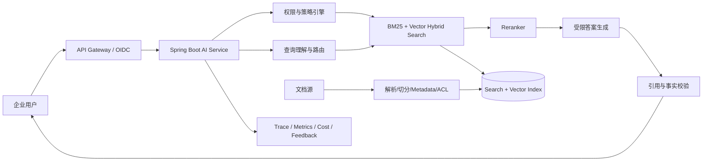
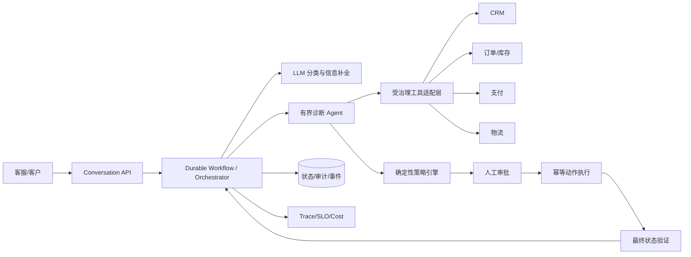
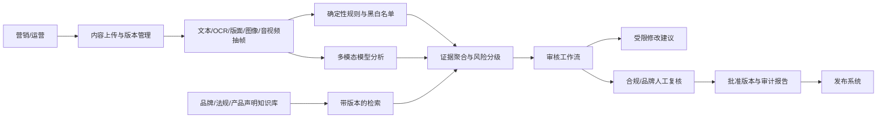

# 从资深 Java 工程师到 AI Agent 解决方案架构师

> 12 个月务实成长路线，目标是在 12 至 18 个月内独立负责客户发现、方案设计、技术架构、PoC、上线交付和团队协同  
> 适用背景：Spring Boot、微服务、分布式系统经验，已实践 LLM、Google ADK、多 Agent、RAG、A2A、MCP、流式会话、记忆和 HITL  
> 更新日期：2026-08-30

## 一、目标岗位的可验证定义

AI Agent 解决方案架构师不是“最会使用 Agent 框架的人”，而是能对以下闭环负责的人：

1. 把模糊业务问题收敛为可验证的用户任务、约束和成功指标。
2. 证明普通软件、检索、单次 LLM、固定工作流、单 Agent、多 Agent中哪一级复杂度足够。
3. 设计模型、数据、工具、状态、权限、人工审批和企业系统之间的可靠边界。
4. 用评测数据和成本模型支持技术决策，而不是用 Demo 或主观体验选型。
5. 把 PoC 推进成有 SLO、可观测性、安全控制、发布门槛和回退能力的系统。
6. 让客户、产品、研发、安全、运维和管理者理解同一个方案，并明确责任、风险和下一步决策。

### 12 个月目标状态

| 能力结果 | 可验证证据 |
|---|---|
| 独立完成需求发现和方案收敛 | 能主持 2 次客户发现工作坊和 1 次方案评审，输出问题陈述、用户旅程、约束、KPI、非目标与开放问题。 |
| 独立完成 Agent 架构设计 | 至少 3 份可评审设计，其中包含复杂度论证、信任边界、状态模型、失败路径、SLO、评测与回滚。 |
| 独立完成 PoC 决策 | 至少 2 个 PoC 使用版本化数据集进行基线对照，并给出继续、缩减或停止的建议。 |
| 推动一次受控试点 | 至少 1 个系统经历离线评测、影子或内部试用、有限用户试点、运行复盘。 |
| 形成团队影响力 | 4 次内部分享、2 份团队模板或标准、至少 2 次他人方案评审记录。 |
| 具备商业和成本意识 | 每个方案能说明价值假设、调用量、单次成功成本、基础设施成本、人工审核成本和容量风险。 |

上述数字是个人成长验收标准，不是通用生产 SLA。具体业务阈值必须由业务基线、风险等级、流量和成本预算共同确定。

## 二、核心能力模型

成熟度采用四级：

- **L1 了解**：能解释概念并运行示例。
- **L2 实现**：能独立完成有边界的功能。
- **L3 设计**：能比较方案、定义指标、处理失败和安全问题。
- **L4 负责**：能推动跨团队交付，基于证据做取舍并承担上线结果。

你的目标不是所有领域都达到 L4，而是架构、交付和沟通达到 L4，模型研究等领域达到足以做正确决策的 L2 或 L3。

| 能力域 | 解决方案架构师需要掌握什么 | 12 个月目标 | 代表性证明 |
|---|---|---:|---|
| AI 与模型能力 | Transformer/embedding 基础；上下文窗口；结构化输出；tool calling；推理模型；多模态；采样参数；模型路由；微调与 RAG 的边界；延迟、质量、价格和数据政策比较 | L3 | 一份模型选型报告，使用同一数据集比较至少 3 个模型配置，并给出路由和回退决策 |
| Agent 与编排架构 | 确定性代码、单次 LLM、Workflow、单 Agent、多 Agent的复杂度阶梯；router、fan-out、orchestrator-worker、handoff、evaluator-optimizer；状态机、预算、停止条件、HITL、MCP/A2A | L4 | Agent 系统设计、序列图、状态机、工具合同、失败路径、ADR 和复杂度对照实验 |
| RAG、知识工程与评测 | 文档治理、解析、切分、metadata、ACL、hybrid search、rerank、query rewrite、引用、时效性；检索与生成分层评测；数据集和 grader 校准 | L3/L4 | 版本化语料与评测集、检索报告、端到端报告、错误分类和回归门槛 |
| 企业集成与微服务架构 | API、事件、事务、幂等、重试、限流、熔断、缓存、流式响应、身份传递、SaaS/遗留系统适配、数据一致性、租户隔离 | L4 | 可运行的 Spring Boot 参考架构、OpenAPI/事件合同、故障注入结果和容量说明 |
| 可观测性、稳定性、安全与成本 | 全链路 trace、质量信号、版本归因；SLO、降级、回退、kill switch；prompt injection、越权、数据泄露、SSRF、记忆污染；token、模型、检索、工具和人工成本 | L3/L4 | Dashboard、告警、runbook、威胁模型、红队报告、成本模型和发布清单 |
| 方案设计与客户沟通 | discovery、场景排序、价值假设、约束、NFR、风险、替代方案、路线图、工作量、RACI、决策记录、面向不同角色表达 | L4 | 客户工作坊材料、方案建议书、执行摘要、里程碑计划、风险台账和评审纪要 |
| 项目管理与团队协作 | PoC 范围控制、依赖和风险管理、Definition of Done、技术拆分、跨团队接口、评审和复盘、知识传递 | L3/L4 | 6 至 12 周交付计划、看板、周报、RAID 日志、复盘和团队标准 |

## 三、你已有的优势、可能短板和优先级

### 3.1 可迁移优势

| 既有经验 | 对 AI Agent 架构的直接价值 | 应刻意放大的方式 |
|---|---|---|
| Spring Boot 与依赖注入 | 工具适配器、策略、模型提供商、检索组件都适合用清晰接口解耦 | 把每个 Agent 工具当作受治理的业务 API，而不是随手暴露的方法 |
| 微服务与分布式系统 | 你已经理解超时、重试、幂等、部分失败、最终一致性、限流和可观测性 | 把 Agent 轨迹当成不确定的分布式工作流，显式设计状态和恢复 |
| 接口与领域建模 | 有能力定义工具 schema、事件合同、错误码、权限和版本兼容 | 为工具、handoff、A2A Task 和审批动作写可测试合同 |
| 企业系统集成 | 熟悉 IAM、网关、数据库、消息队列和遗留系统 | 重点发展身份传播、代表用户行动、最小权限与审计能力 |
| 工程化实践 | CI/CD、测试、配置和发布经验可直接迁移 | 将模型、prompt、工具、知识索引、memory policy 和 grader 作为一个版本化配置包 |
| 技术团队协作 | 能拆任务、做评审、推动交付 | 从“模块负责人”升级为“决策、接口、风险和验收负责人” |

### 3.2 最可能存在的能力短板

这些是基于典型资深 Java 工程师转型路径的假设，应在第 1 个月通过基线任务验证，而不是直接当作事实。

| 可能短板 | 常见表现 | 诊断任务 |
|---|---|---|
| 对模型行为缺少实验直觉 | 过度依赖框架默认值；无法解释质量波动来自模型、prompt、检索还是工具 | 对同一 50 题数据集做模型、temperature、结构化输出和工具描述的单变量实验 |
| RAG 停留在向量检索 Demo | 只关注向量库，不关注文档结构、ACL、时效、召回、重排、引用和无答案 | 建立带权限、答案证据和不可回答问题的 100 题数据集 |
| 评测体系不足 | 以“看起来不错”和用户点赞判断质量 | 建立 outcome、trajectory、安全、延迟、成本五类指标，并校准 LLM judge |
| 多 Agent 复杂度偏好 | 先设计多个角色，再寻找业务必要性 | 用同一数据集比较规则/Workflow、单 Agent、多 Agent，记录增益和额外成本 |
| AI 安全理解偏提示词 | 认为 system prompt 能阻止越权和注入 | 做提示注入、工具投毒、跨租户、SSRF、数据外泄和循环滥用测试 |
| 缺少售前与业务价值表达 | 技术图完整，但无法说明 KPI、ROI、风险承担和实施边界 | 把一个技术方案压缩为 1 页管理层摘要和 10 分钟客户汇报 |
| 缺少端到端交付经验 | 能完成 Agent 核心代码，但没有试点、运营、支持和回滚 | 推进一个内部真实用户试点，运行至少 4 周并做复盘 |

### 3.3 优先补齐顺序

1. **评测驱动的 Agent/RAG 工程**：没有评测就无法做架构取舍、模型选择和上线决策。
2. **安全的工具与权限边界**：企业 Agent 的难点是代表谁、能做什么、何时确认、如何追责。
3. **上下文、知识和状态治理**：区分运行状态、会话、检索知识、长期记忆和配置版本。
4. **PoC 到生产的稳定性、观测与成本**：从 Demo 思维切换为可运营系统。
5. **客户发现、方案表达和交付治理**：从回答“怎么做”升级到澄清“为什么做、做到什么程度、谁承担什么风险”。
6. **多 Agent 和互操作协议深化**：在真实边界和评测证明需要后再扩大投入。

### 3.4 不应过早投入

| 暂缓内容 | 原因 | 何时再投入 |
|---|---|---|
| 从零训练基础模型或深入训练基础设施 | 与企业 Agent 方案岗位的近期收益不匹配 | 出现微调、自托管或模型平台的明确客户需求时 |
| 为学框架而横向追 5 至 10 个 Agent 框架 | 框架 API 变化快，容易替代架构能力和评测能力 | 已经用一套主栈完成生产级闭环后，按项目约束对比第二套 |
| 没有基线的复杂多 Agent/Agent swarm | 增加非确定性、延迟、成本、状态和排障难度 | 单 Agent 在受控评测中明确达不到需求，且任务可并行或需权限隔离时 |
| 过早构建通用 Agent 平台 | 没有 2 至 3 个真实用例时，抽象通常来自想象 | 两个项目出现重复的运行、评测、权限、观测和发布需求后 |
| 把所有内部 API 改造成 MCP | MCP 是互操作边界，不替代普通内部 API 和授权 | 存在独立客户端、跨团队发现、跨语言复用或生态互操作需求时 |
| 追求“自主运行数天”但没有检查点和验证器 | 长时间运行只会放大错误和成本 | 已有幂等工具、外部状态、checkpoint、预算、kill switch 和可执行验收时 |
| 只研究 prompt 技巧 | Prompt 只是系统配置的一部分 | 持续学习，但投入必须和数据、工具、评测、权限、运维同步 |

## 四、技术路线和主栈建议

### 主航道

- **业务与集成层**：Java 21+、Spring Boot、Spring Security、Spring AI 或 Google ADK for Java。
- **Agent 实验层**：Google ADK for Java 作为已熟悉主框架；必要时用 LangChain4j 对比 Java 生态能力。
- **评测与数据分析**：Python 维持可工作能力，用于 notebook、数据集处理、统计和主流评测库，不要求转为 Python 后端专家。
- **数据与检索**：PostgreSQL + pgvector 或 Elasticsearch/OpenSearch 起步，结合 BM25、向量检索和 reranker；先避免引入过多数据库。
- **状态与异步执行**：PostgreSQL/Redis + Kafka 等现有企业组件；长任务优先考虑成熟工作流或任务引擎，而不是把可靠性全部交给 Agent 框架。
- **可观测性**：OpenTelemetry、Micrometer、Prometheus/Grafana 和集中日志，增加 Agent task、model、tool、retrieval、policy、cost 的关联属性。
- **身份与策略**：OIDC/OAuth2、企业 IAM、细粒度授权、策略执行点、短期凭证和审计日志。
- **协议**：内部工具优先普通 Java 接口或 REST/gRPC；需要标准 host-to-tool 边界时使用 MCP；独立 Agent 应用互操作时使用 A2A，并固定经过评审的协议版本。

### 必须形成的复杂度决策习惯

```text
确定性代码/检索
    ↓ 只有无法满足量化需求时
一次受限 LLM 调用或结构化输出
    ↓
代码控制的 Workflow
    ↓
单 Agent + 有界工具循环
    ↓
多 Agent + 明确委派合同
    ↓
跨组织或信任边界的 A2A Agent
```

每升一级必须回答：简单方案失败在哪里、预期提升是什么、增加多少延迟/成本/风险、用什么评测确认、失败时如何退回上一级。

## 五、未来 0 至 3 个月：从“会实现”升级为“会度量和设计”

### 阶段目标

独立完成一个企业知识助手，从业务问题、知识治理、权限、RAG、评测、观测到架构文档形成闭环。重点不是功能数量，而是建立可复用的方法。

### 学习与行动清单

| 周期 | 学习主题 | 推荐资料类型 | 必须输出 |
|---|---|---|---|
| 第 1 至 2 周 | 模型能力边界、结构化输出、tool calling、上下文、模型选择 | 厂商官方模型与 tool calling 文档；模型卡；小型对照实验 | `model-selection.md`：任务、模型配置、质量、p50/p95、失败类型、单次成功成本 |
| 第 2 至 4 周 | RAG 数据链路、hybrid search、rerank、metadata、ACL、引用 | 信息检索基础；Spring AI/LangChain4j 官方 RAG 文档；权威 RAG 评测实践 | 文档语料说明、切分 ADR、检索实验报告、100 题以上版本化评测集 |
| 第 4 至 6 周 | Agent 复杂度阶梯、工具 schema、预算、停止与回退 | Anthropic Agent 模式、Google ADK 官方文档、现有 Agent 必读指南 | Workflow 与 Agent 两种实现及对照报告；工具 OpenAPI/schema |
| 第 6 至 8 周 | Agent/RAG 评测 | 官方 eval 指南；GAIA、τ-bench 等基准的方法部分 | outcome、retrieval、citation、abstention、latency、cost 六类指标和 grader 校准样本 |
| 第 8 至 10 周 | 可观测性与安全基础 | Spring AI observability、OpenTelemetry、OWASP Agentic Top 10、AgentDojo | trace schema、dashboard、威胁模型、20 个对抗用例 |
| 第 10 至 12 周 | 架构表达和方案评审 | C4、序列图、ADR、威胁建模、技术方案模板 | 完整设计、3 个 ADR、10 分钟演示和 30 分钟评审材料 |

### 必做 PoC：带权限和引用的企业知识助手

最低范围：

- 两类用户、两级文档权限，检索时强制 ACL，不允许仅在生成后过滤。
- 结构化文档和非结构化文档各至少一种。
- BM25、向量和 hybrid + rerank 三种检索基线。
- 对每个事实答案给出可定位引用；没有证据时拒答或请求澄清。
- 流式会话、取消、超时、模型回退和反馈入口。
- 全链路 trace 能关联用户请求、检索、rerank、模型、引用、版本、延迟和成本。

### 量化验收门槛

| 维度 | 训练项目建议门槛 | 说明 |
|---|---:|---|
| 数据集 | ≥100 个问题 | 包含常见、长尾、无答案、过期、冲突证据和越权问题；开发集与保护回归集分开 |
| 检索 | 对可回答问题的 Recall@5 ≥ 0.85 | 若业务问题必须多跳，另建 multi-hop slice，不用总体平均掩盖 |
| 引用 | 引用支持主张的准确率 ≥ 0.95 | 人工标注至少 30 题用于校准自动 grader |
| 无答案 | 正确拒答/澄清率 ≥ 0.90 | 不允许靠生成常识绕过企业知识边界 |
| 权限 | 保护集内跨租户或越权命中为 0 | 这是 guardrail，不与平均质量互相抵消 |
| 稳定性 | 关键 30 题各运行 3 次，成功率和方差可解释 | 记录完整系统配置指纹 |
| 性能与成本 | p50、p95 和单次成功成本均可测且在预先声明预算内 | 预算由你在实验前根据体验目标和可接受成本填写，不能事后设线 |
| 回归 | 每次变更自动运行检索、生成、安全和合同测试 | 能按 model/prompt/index/tool/grader 版本归因 |

### 作品集

- 一页业务问题与成功指标
- C4 System Context、Container 图和一次端到端序列图
- RAG 数据流、ACL 信任边界和数据生命周期说明
- ADR：向量库/混合检索选择、模型选择、Workflow 与 Agent 边界
- 评测集、指标定义、grader 校准和错误分类报告
- OpenTelemetry Dashboard 截图、告警规则和 runbook
- 10 分钟产品演示视频和 15 页以内方案 Deck

### 3 个月退出条件

- 你能解释每次质量提升来自数据、检索、prompt、模型还是工具，而不是只展示最终分数。
- 一位不参与开发的工程师能依据文档部署、运行评测并定位一次失败。
- 一位安全或架构同事评审后，没有未处理的跨租户、越权和敏感日志问题。

## 六、未来 4 至 6 个月：从单点 PoC 升级为跨系统业务流程

### 阶段目标

完成一个带真实业务状态、多个系统工具、HITL 和部分失败恢复的流程自动化 PoC；用数据证明哪些步骤由代码控制，哪些交给 Agent，是否需要多 Agent。

### 学习与行动清单

| 主题 | 需要掌握的决策 | 实践输出 |
|---|---|---|
| 工作流与 Agent 控制拓扑 | router、fan-out、orchestrator-worker、handoff、evaluator-optimizer；最终结果和副作用由谁负责 | 控制拓扑图、状态机、成功/失败/取消/升级序列图 |
| 工具与委派合同 | schema、授权、超时、重试、幂等、取消、部分结果、预算、审计 | 每个工具和 delegation edge 的合同表与自动化合同测试 |
| 状态与记忆 | run state、conversation、retrieved knowledge、durable memory、procedural config 分离 | 状态模型、并发与恢复 ADR、保留/删除策略 |
| MCP/A2A | 普通 API、MCP、A2A 的适用边界；版本、发现、信任、授权、兼容和 conformance | 一项真实协议边界；版本固定；正向、负向、兼容和安全测试 |
| HITL | 风险分级、审批上下文、超时、重新分配、审计、取消和人工接管 | 审批状态机、权限矩阵、操作审计与 SLA |
| 可靠性 | checkpoint、outbox、重放、死信、熔断、降级、kill switch | 故障注入报告、恢复演练、runbook |
| 方案与项目管理 | discovery、范围、依赖、风险、RACI、阶段门槛、周报和变更控制 | 6 至 8 周交付计划、RAID 台账、评审纪要和复盘 |

### 必做 PoC：订单/客服异常处理 Agent 工作流

建议流程：读取工单 → 拉取客户和订单 → 检索政策 → 诊断原因 → 生成处置建议 → 对退款/补偿等动作走策略和人工审批 → 执行工具 → 验证最终状态 → 通知客户。

实现三套可比较方案：

1. 代码控制 Workflow + 局部 LLM。
2. 单 Agent + 有界工具循环。
3. 仅在任务可并行或权限隔离有证据时增加 specialist Agent。

### 量化验收门槛

| 维度 | 建议门槛 |
|---|---:|
| 评测任务 | ≥60 个多步任务，覆盖正常、歧义、依赖故障、政策冲突、越权和人工拒绝 |
| 重复试验 | 关键任务至少 3 trials，报告分布而不只报最好一次 |
| 最终状态正确率 | ≥0.85，且相对最简单可行基线有明确提升；未提升则回退简单架构 |
| 工具参数和状态变更正确率 | ≥0.95 |
| 未授权或未确认的高风险动作 | 0 |
| 依赖故障后的正确恢复/升级 | ≥0.90 |
| 循环控制 | 100% 请求受 turn/time/token/tool/cost budget 限制，超限可解释地停止或升级 |
| 可观测性 | 100% 轨迹能关联 task、用户、配置版本、工具、审批、状态变化和成本 |
| 协议 | 若使用 MCP/A2A，必须有版本、auth、超时、取消、兼容、负向和对抗测试；否则写明不采用原因 |

### 作品集

- AI/Agent System Design 完整文档
- Workflow、单 Agent、多 Agent 的同预算对照评测
- 工具与委派合同、权限矩阵、HITL 状态机
- 5 个以上 ADR，包括是否采用 MCP/A2A、状态存储、幂等和回退策略
- 故障注入报告：模型超时、工具 5xx、重复事件、消息乱序、人工审批超时、预算耗尽
- 运行 Dashboard、告警、kill switch 和演练记录
- 面向客户的方案建议书、范围、里程碑、RACI 和风险清单

### 6 个月退出条件

- 能在 15 分钟内向客户解释业务价值、范围、数据要求、风险和 PoC 退出标准。
- 能在 45 分钟架构评审中解释每一个 model-directed 决策和每一个外部副作用的责任边界。
- 能用评测证明复杂 Agent 架构比简单基线更好，或者有勇气建议不使用多 Agent。
- 系统在注入故障后能够恢复、降级或转人工，而不是重新开始或静默失败。

## 七、未来 7 至 12 个月：从架构设计升级为试点和团队负责人

### 阶段目标

选择前两个 PoC 中价值更清晰的一个，推进到内部或客户有限试点；完整经历发现、设计、估算、评审、上线门槛、运营、复盘和路线图决策。

### 分阶段行动清单

| 月份 | 主任务 | 关键产出 | 决策门槛 |
|---|---|---|---|
| 7 至 8 月 | 客户/业务发现与试点立项 | stakeholder map、用户旅程、现状基线、价值假设、数据清单、风险、NFR、非目标 | 业务 owner、安全、数据 owner 和技术 owner 对问题、数据使用和试点范围达成一致 |
| 8 至 9 月 | 生产设计和计划 | 系统设计、容量与成本模型、威胁模型、DPIA/合规检查、SLO、发布与回滚、RACI | 架构、安全、运维和产品评审通过；阻塞问题有 owner 和解决期限 |
| 9 至 10 月 | 硬化与离线门槛 | 保护回归集、对抗集、集成/恢复测试、grader 校准、runbook、dashboard | 质量、安全、延迟、成本和恢复门槛全部通过，不能用平均分豁免严重风险 |
| 10 至 11 月 | 影子/内部用户试用 | 版本化配置、用户培训、支持通道、每日监控、失败回流 | 无未授权动作；主要 SLO 在观察窗内稳定；重大失败可回滚 |
| 11 至 12 月 | 有限试点与复盘 | 业务 KPI、系统指标、用户研究、成本、事故与失败分类、下一阶段建议 | 基于证据选择扩大、保持、缩减或停止，不把继续开发当作默认答案 |

### 试点验收框架

不要在没有现状基线时预设虚假的 ROI。第 7 月先测量，再冻结目标。

| 维度 | 基线采集 | 试点目标制定方式 | 必须设为硬门槛的项目 |
|---|---|---|---|
| 业务 | 人工处理时长、一次解决率、返工率、知识查找时间 | 与业务 owner 确定最小可感知改进和置信区间 | 不适用，除非涉及法规或合同 |
| 质量 | 当前人工/系统正确率；关键错误类型 | 按任务 slice 设阈值，不只看总平均 | 高风险错误、错误外部动作 |
| 安全 | 当前访问控制和审计要求 | 威胁模型、数据分类和安全评审决定 | 越权、跨租户泄露、未确认高风险动作均为 0 容忍 |
| 可靠性 | 当前服务 SLO 和依赖稳定性 | 根据用户旅程设成功、延迟、超时和恢复 SLO | 无界循环、无法取消、无 kill switch 不得试点 |
| 成本 | 当前人工成本、调用量、峰值、供应商费用 | 计算每次尝试成本、每次成功成本和人工复核成本 | 必须有单任务/用户/租户预算和异常熔断 |
| 采用 | 活跃用户、任务完成、转人工、满意度 | 结合访谈，不把点赞作为唯一指标 | 用户必须知道系统边界和人工接管方式 |

### 12 个月作品集

建议整理成一个脱敏的“架构师案例包”：

1. 1 页 Executive Summary：问题、价值、推荐方案、成本、风险和决策请求。
2. Discovery Pack：stakeholder、用户旅程、现状指标、约束和非目标。
3. Architecture Pack：C4、数据流、信任边界、序列图、状态机、部署图和 ADR。
4. AI Evaluation Pack：配置指纹、数据集、grader、基线、结果、方差、错误分类和发布门槛。
5. Security Pack：威胁模型、权限矩阵、对抗测试、审计和数据生命周期。
6. Operations Pack：SLO、dashboard、告警、runbook、容量、成本、降级、回滚和演练。
7. Delivery Pack：里程碑、RACI、RAID、周报、变更记录和复盘。
8. Communication Pack：客户版 Deck、技术版 Deck、10 分钟 Demo、FAQ 和反对意见处理。

### 12 个月退出条件

- 至少一个真实试点连续运行 4 周以上，有真实用户、可归因配置、线上信号和复盘。
- 你主持过发现、架构、安全、上线和复盘五类会议，并留下决策记录。
- 你能给出扩大、暂停或停止的证据，不以“技术做出来了”代替业务成功。
- 团队内至少两人能使用你的模板和标准完成类似方案，而不是只有你能维护。

## 八、三个企业 AI Agent 作品集案例

## 案例 A：带权限、证据和时效性的企业知识助手

### 业务问题

员工需要在制度、产品文档、工单、技术手册中查找答案。现有搜索召回差、权限分散、答案难追溯，专家重复回答相同问题。

### 推荐架构



关键决策：

- ACL 在检索前或检索内强制执行，不依赖模型和生成后过滤。
- 文档、chunk、引用保留 source、版本、生效时间、owner 和权限 provenance。
- 先用固定 RAG Workflow；只有查询需要多轮澄清或动态选择工具时才增加 Agent。
- 无证据、证据冲突或文档过期时必须拒答、标注不确定性或升级专家。

### 关键风险与控制

| 风险 | 控制 |
|---|---|
| 跨租户/越权检索 | 身份绑定查询、过滤下推、租户隔离、保护集与审计 |
| 过期和冲突知识 | 生效时间、source of truth、冲突检测、owner 和重建策略 |
| 引用看似相关但不支持结论 | claim-to-citation 评测、引用定位、人工校准 grader |
| 文档提示注入 | 检索内容视为不可信数据；不允许其提升权限或改变系统策略 |
| 成本和延迟失控 | 查询分类、缓存、top-k 和 rerank 预算、模型路由、流式输出 |

### 评测指标

- Retrieval：Recall@k、MRR/nDCG、ACL violation。
- Generation：事实正确、完整、引用支持率、无答案拒答、冲突处理。
- System：task success、p50/p95、失败率、单次成功成本、模型与检索依赖可用性。
- Product：搜索时间、专家转派率、一次解决率、用户修正率。

### 可展示成果

RAG 评测报告、ACL 威胁模型、数据生命周期图、三种检索方案对照、可运行 Demo、Dashboard、ADR 和客户版 ROI 假设。

## 案例 B：多系统订单/客服异常处理 Agent 工作流

### 业务问题

客服需要跨 CRM、订单、库存、物流、支付和政策系统诊断异常，人工切换多系统，处理慢且规则执行不一致。

### 推荐架构



控制原则：

- 流程状态、重试、checkpoint 和审批由可靠工作流控制，不由 LLM 对话记忆承担。
- Agent 可以建议动作，但策略引擎决定是否允许，HITL 决定是否批准高风险动作。
- 退款、补偿、取消等动作使用 idempotency key，并在执行后验证外部系统最终状态。
- specialist Agent 只有在并行、上下文隔离或权限隔离带来可测收益时引入。

### 关键风险与控制

| 风险 | 控制 |
|---|---|
| 重复退款或重复通知 | 幂等键、outbox、执行前后状态检查 |
| Agent 越权或被工单内容注入 | 外部策略执行、最小权限、内容不授予 authority、攻击测试 |
| 多系统部分成功 | Saga/补偿、checkpoint、人工处理队列、可重放事件 |
| 多 Agent 循环和成本放大 | 委派深度、并发、turn、token、时间和费用预算；loop detection |
| 审批上下文不足 | 展示证据、政策、影响、建议动作和可撤销性；审批结果进入审计链 |

### 评测指标

- 端到端最终状态正确率、一次解决率、人工处理时长。
- 工具选择、参数、顺序和不必要动作率。
- 政策遵循、确认遵循、越权动作、注入成功率。
- 依赖失败恢复、重复事件处理、审批超时、取消成功。
- p95 完成时间、每个成功工单成本、人工复核分钟数。

### 可展示成果

Workflow/单 Agent/多 Agent 对照实验、状态机、工具合同、权限矩阵、HITL 界面、故障注入演练、运行手册和方案评审 Deck。

## 案例 C：多模态营销内容合规审核与修改助手

### 业务问题

营销材料包含文案、图片、PDF、视频帧和落地页。人工需要检查品牌规范、禁用词、产品声明、版权和行业合规，速度慢且容易漏检。

### 推荐架构



控制原则：

- 发布动作不由审核 Agent 自主执行，必须由授权人或独立发布策略控制。
- 规则引擎负责确定性要求，多模态模型负责语义和复杂上下文判断。
- 每个风险结论必须携带内容位置、证据、规则版本、置信度和建议。
- 法规、品牌规范、产品能力声明必须版本化，并能复现历史审核结果。

### 关键风险与控制

| 风险 | 控制 |
|---|---|
| 严重违规漏检 | 高风险类别优化 recall；规则与模型并行；人工复核；保护回归集 |
| 误报导致运营效率下降 | 分风险等级阈值、证据展示、可解释原因、人工反馈闭环 |
| 图文组合产生误导 | 保留版面关系，进行跨模态联合判断，而不是只抽取文字 |
| 规则和法规变化 | owner、生效日期、版本、灰度评测和历史重放 |
| 训练/日志泄露未发布材料 | 数据分类、供应商政策审查、加密、最小保留和受控日志 |

### 评测指标

- 按风险类别统计 precision、recall、F1，严重风险以 recall 和漏检为硬门槛。
- 证据定位正确率、规则引用准确率、风险级别一致性。
- 修改建议保真度、品牌一致性和人工采纳率。
- 审核周转时间、人工复核分钟数、返工率、发布后事故数。
- 不同语言、图片质量、版式、长文档和对抗内容的 slice 表现。

阈值必须由历史审核样本、合规风险容忍度和人工成本确定，不能用一个总体 F1 替代严重风险门槛。

### 可展示成果

多模态数据集与标注指南、风险 taxonomy、规则/模型对照、审核报告 UI、错误分析、威胁模型、试点方案和管理层摘要。

## 九、从高级工程师到解决方案架构师的差距清单

| 能力差距 | 高级工程师常见关注点 | 架构师应达到的表现 | 练习方法 | 验证方式 |
|---|---|---|---|---|
| 问题定义 | 接收需求并实现 | 识别用户、任务、现状基线、约束、KPI、非目标和决策人 | 对三个需求分别做 60 分钟 discovery，输出一页问题陈述 | 业务方能确认问题和指标，且范围可在 PoC 周期内完成 |
| 复杂度控制 | 倾向选择熟悉框架 | 用证据从代码、LLM、Workflow、单 Agent、多 Agent逐级选择 | 同一任务实现三个基线 | 能说明每级增益、成本和回退条件 |
| 模型选型 | 选最新或最强模型 | 基于质量、延迟、成本、工具、多模态、数据和供应商风险选型 | 建 50 至 100 题 benchmark 比较模型 | 输出可复现实验和 routing ADR |
| RAG/知识治理 | 接向量库 | 管理 ingestion、权限、结构、时效、引用、冲突和删除 | 做 ACL + hybrid + rerank + citation 项目 | 越权为 0；检索、生成和产品指标可分层解释 |
| Agent 控制面 | 实现调用循环 | 定义预算、停止、取消、HITL、fallback、checkpoint、kill switch | 对依赖故障和预算耗尽做演练 | 所有失败进入可恢复、降级或人工路径 |
| 工具与 API | 能调用业务接口 | 定义 authority、schema、幂等、超时、重试、审计和副作用验证 | 为 5 个工具写合同与负向测试 | 未授权动作 0，重复调用不产生重复副作用 |
| 状态与记忆 | 用聊天记录或一个 memory store | 区分运行、会话、知识、长期记忆、配置并治理生命周期 | 画状态表并实现删除和恢复 | 能回答谁读写、多久保留、如何纠错、并发如何解决 |
| 评测 | 人工试几个问题 | 版本化数据、grader、基线、重复试验、发布门槛和线上信号 | 建保护集和错误 taxonomy | 每次变更可归因，重大风险不被平均分掩盖 |
| 安全与隐私 | 依赖 prompt 和网关 | 把模型视为不可信组件，外部执行授权和策略 | 做 AgentDojo 风格攻击集和威胁建模 | 注入、越权、外泄、SSRF、记忆污染均有预防、检测和处置 |
| 可靠性与运维 | 关注服务 uptime | 同时管理 task success、外部状态、模型/工具依赖、降级和回滚 | 故障注入、容量测试、on-call 演练 | SLO、dashboard、告警和 runbook 被另一位工程师验证 |
| 成本治理 | 统计 token | 计算每次尝试/成功成本、人工复核、峰值容量和预算 | 做模型路由、缓存、top-k、并发的敏感性分析 | 能预测 1x/10x 流量成本并设置预算熔断 |
| 方案表达 | 展示技术细节 | 对管理层、业务、架构、安全分别表达价值和风险 | 同一方案做 1 页、10 分钟、45 分钟三个版本 | 不同受众能复述决策、风险和下一步 |
| 估算与计划 | 估开发工时 | 管理发现、数据、评测、安全、集成、试点和运营依赖 | 为案例 B 做 8 周计划和 RAID | 每阶段有 owner、入口、证据、go/no-go 和回退 |
| 决策记录 | 会议口头决定 | 用 ADR 记录上下文、选项、证据、后果和重审条件 | 每个 PoC 写 5 个关键 ADR | 三个月后他人能理解为什么这样选以及何时重审 |
| 团队杠杆 | 自己解决难题 | 建模板、标准、评审机制，让团队重复交付 | 建 Agent 设计清单和 eval starter kit | 至少两名同事独立使用并反馈改进 |

## 十、客户方案和交付的标准工作法

### 1. Discovery 前

- 明确参与者：业务 owner、最终用户、数据 owner、IT、架构、安全、合规、运维。
- 收集当前流程、处理量、耗时、错误、系统、数据、权限、例外和人工升级路径。
- 准备场景评分表：业务价值、可验证性、数据可用性、动作风险、集成复杂度、采用阻力。

### 2. Discovery 中

- 从真实案例和反例出发，不问“你想要什么 Agent”。
- 找出可外部验证的最终状态，例如工单关闭、字段更新、文档证据、审核结论。
- 标出必须由人决定的节点，以及允许系统自主行动的额度和范围。
- 明确失败的业务代价，区分可以拒答、必须升级和绝不能出错的场景。

### 3. 方案设计

- 先画系统边界、信任边界、主流程和失败流程，再选模型和框架。
- 至少比较简单方案、推荐方案和延后方案。
- 每个数字写清输入、公式、单位和置信度；没有基线就列测量任务。
- 给出 PoC 的进入条件、退出标准、停损条件和生产化差距。

### 4. PoC

- 第一周冻结问题、数据版本、基线和评测口径。
- 每周展示评测、错误分类、成本和风险变化，不只演示 happy path。
- 新增复杂度前必须说明简单方案的失败证据。
- 结束时给出 go、pivot、stop 三种建议之一和对应证据。

### 5. 试点与生产

- 采用离线评测 → 影子/回放 → 内部用户 → 小范围试点 → 扩大的证据门槛。
- 将代码、模型、prompt、工具、知识索引、memory、guardrail 和 grader 作为一致的版本单元发布和回滚。
- 对不可逆动作使用权限、确认、幂等、审计和人工处置，而不是假设可以完整回滚。

## 十一、每周执行节奏

在全职工作的情况下，建议每周投入 8 至 10 小时：

| 活动 | 时间 | 输出要求 |
|---|---:|---|
| 原理和官方资料 | 2 小时 | 每周一页笔记，只记录可影响当前项目决策的内容 |
| 编码与实验 | 3 至 4 小时 | 每次实验只改变一个主要变量，结果进入评测报告 |
| 架构与文档 | 2 小时 | 每周更新图、ADR、风险、成本或 runbook 中的一项 |
| 沟通训练 | 1 小时 | 录制 5 至 10 分钟讲解，删掉听众不需要的技术细节 |
| 复盘 | 1 小时 | 本周证据、失败、下周假设、停止事项 |

每月安排一次 60 分钟模拟架构评审：邀请一位后端、一位产品/业务和一位安全/运维同事分别挑战方案。

## 十二、推荐资料路线

优先使用本工程的 [AI Agent 必读技术资料指南](./ai-agent-essential-reading-2026.md)，再按当前项目选择官方资料：

- [Google ADK Documentation](https://google.github.io/adk-docs/) 与 [ADK for Java Codelab](https://codelabs.developers.google.com/adk-java-getting-started)
- [Spring AI Reference](https://docs.spring.io/spring-ai/reference/api/) 与 [Spring AI Observability](https://docs.spring.io/spring-ai/reference/observability/index.html)
- [LangChain4j Documentation](https://docs.langchain4j.dev/)，尤其是 RAG、Tools 与 Agent 章节
- [Anthropic: Building effective agents](https://www.anthropic.com/engineering/building-effective-agents)
- [Anthropic: Demystifying evals for AI agents](https://www.anthropic.com/engineering/demystifying-evals-for-ai-agents)
- [Google: A developer's guide to production-ready AI agents](https://cloud.google.com/blog/products/ai-machine-learning/a-devs-guide-to-production-ready-ai-agents)
- [Model Context Protocol Specification](https://modelcontextprotocol.io/specification/)
- [A2A Protocol Specification](https://a2a-protocol.org/latest/specification/)
- [OWASP Top 10 for Agentic Applications](https://genai.owasp.org/resource/owasp-top-10-for-agentic-applications-for-2026/)
- [OpenTelemetry Semantic Conventions](https://opentelemetry.io/docs/specs/semconv/)

资料使用原则：官方文档用于当前 API 和产品行为，论文用于理解方法和证据，工程复盘用于发现失败模式。不要让课程观看时长替代项目证据。

## 十三、每季度自评表

每项按 0 至 3 分评分：0 无证据，1 能解释，2 能独立完成，3 能指导他人并承担结果。

| 领域 | Q1 目标 | Q2 目标 | Q4 目标 | 证据链接 |
|---|---:|---:|---:|---|
| 业务发现与问题定义 | 1 | 2 | 3 | |
| 模型与 AI 能力选择 | 2 | 2 | 3 | |
| Agent 架构与复杂度控制 | 2 | 3 | 3 | |
| RAG 与知识治理 | 2 | 3 | 3 | |
| 评测与发布门槛 | 2 | 3 | 3 | |
| 企业集成与状态管理 | 3 | 3 | 3 | |
| 安全与权限 | 1 | 2 | 3 | |
| 稳定性与可观测性 | 2 | 3 | 3 | |
| 成本与容量 | 1 | 2 | 3 | |
| 客户沟通与方案表达 | 1 | 2 | 3 | |
| 项目管理与团队协作 | 2 | 2 | 3 | |

不要用总分掩盖硬短板。安全、评测、客户发现、发布与回滚任何一项低于 2，都不应把自己定位为可独立负责生产方案。

## 十四、12 至 18 个月的角色转换建议

12 个月后，不应继续只增加技术栈广度。后续 6 个月应争取承担真实角色责任：

- 作为一个客户或内部项目的 Solution Owner，而不只是核心开发。
- 对范围、架构、评测、安全、成本、里程碑和上线建议统一负责。
- 带 2 至 5 人小组交付一个受控试点，至少培养一名可接手模块和评测的工程师。
- 参与售前澄清、方案报价、工作量估算、风险谈判和上线复盘。
- 将三个项目案例整理为脱敏作品集，在面试或晋升时以“问题、决策、证据、结果、反思”讲述，而不是罗列框架名。

最终判断标准很简单：当客户提出一个模糊的 Agent 需求时，你能够让团队在较短时间内知道是否值得做、先做什么、怎样证明、哪里不能自动化、怎样安全上线，以及失败时如何退出。
