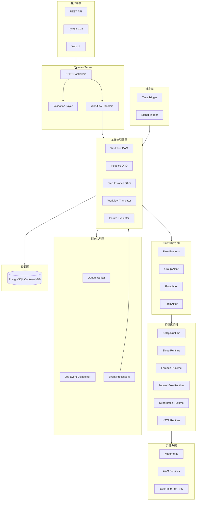
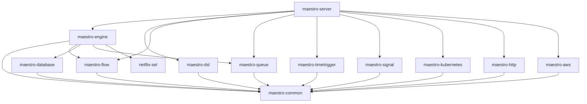
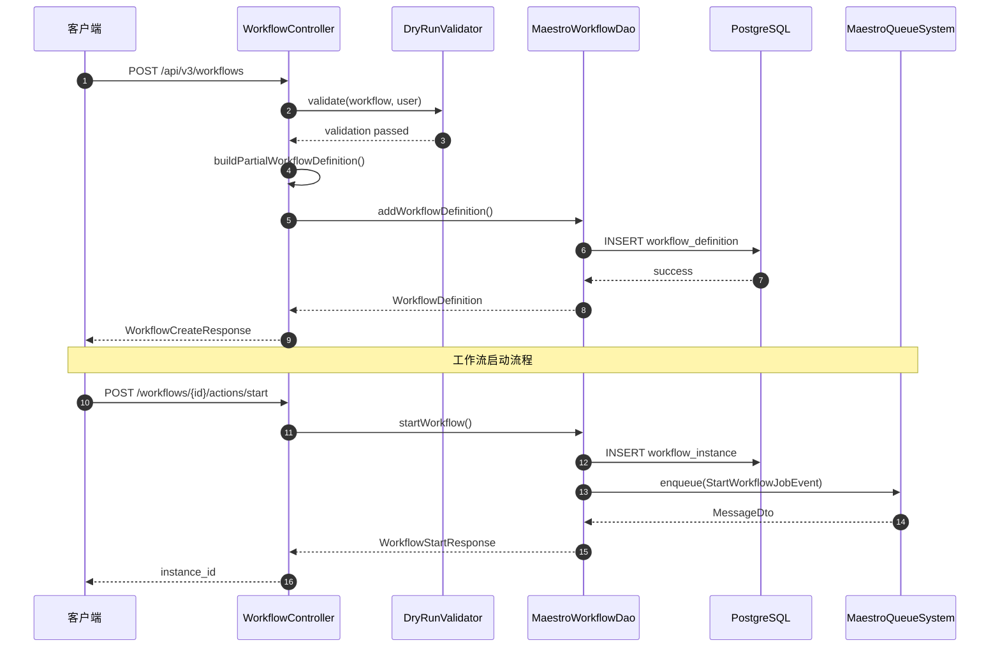
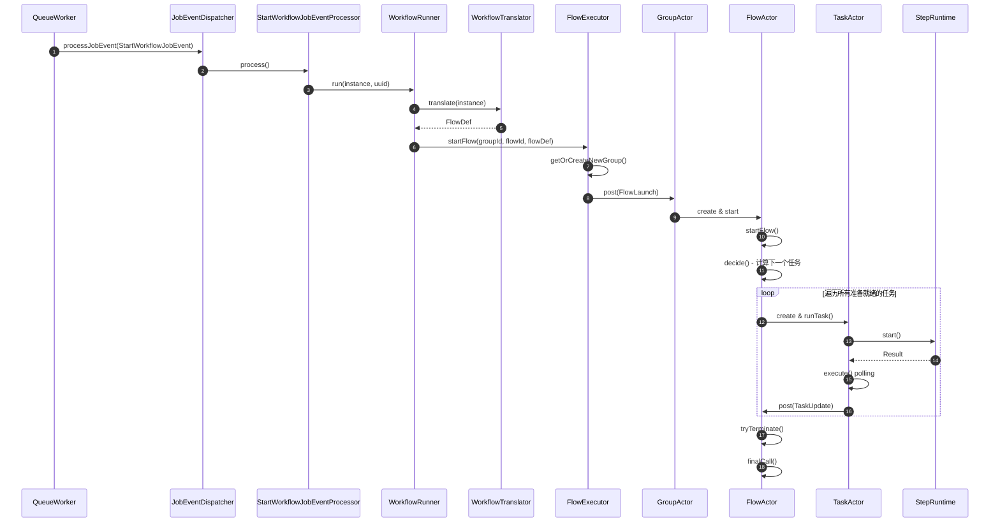
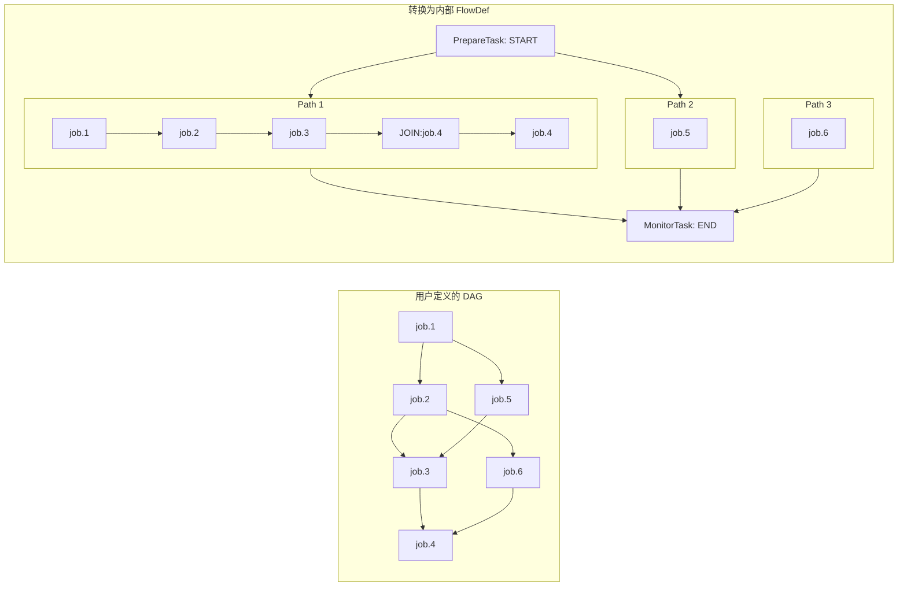
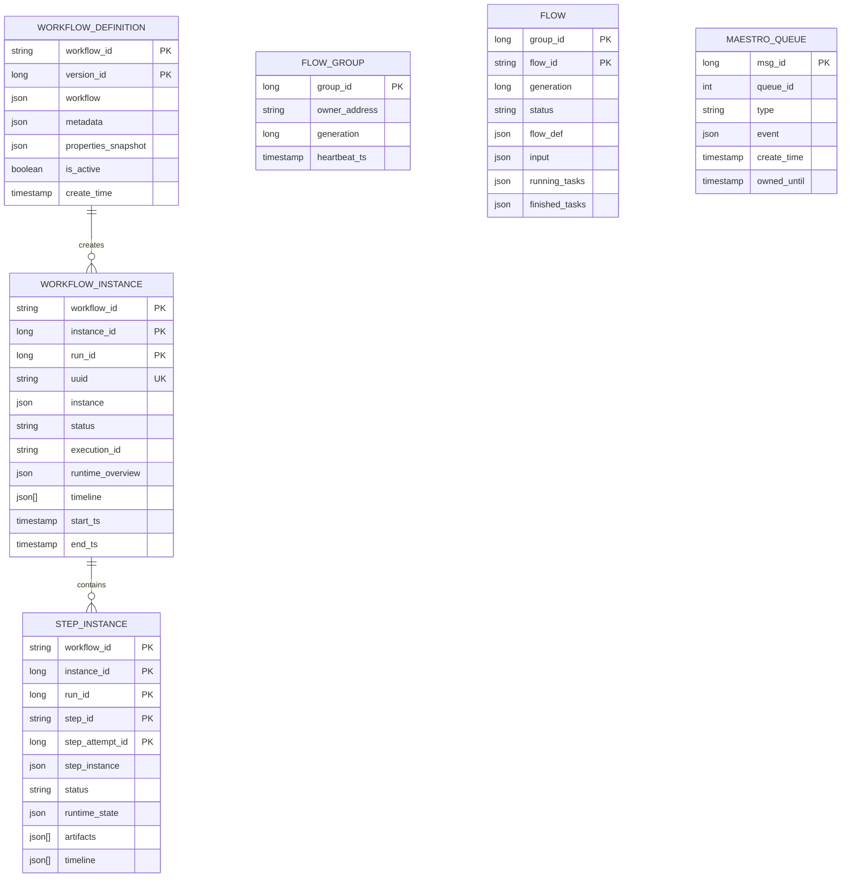

# Netflix Maestro 系统架构与实现深度分析

## 1. 项目概述与核心价值

### 1.1 核心解决痛点

Netflix Maestro 是一个**通用型工作流编排平台**，提供完全托管的工作流即服务（Workflow-as-a-Service, WAAS）。它解决了以下核心问题：

- **大规模工作流调度**：每天调度数十万个工作流，数百万个任务，并保持严格的 SLO
- **多租户支持**：服务于数千名用户，包括数据科学家、数据工程师、ML工程师、软件工程师等
- **复杂 DAG 编排**：支持动态工作流（foreach 循环、while 循环、子工作流等）
- **高可用与容错**：采用无状态微服务架构，支持水平扩展和故障恢复
- **表达式求值安全**：通过自研的 SEL（Simple Expression Language）提供安全的参数化能力

### 1.2 适用场景

| 场景 | 说明 |
|:---|:---|
| 数据管道编排 | ETL 流程、数据仓库更新、增量处理 |
| 机器学习工作流 | 模型训练、特征工程、模型部署流水线 |
| Notebook 执行 | Jupyter Notebook 的调度执行（通过 Papermill） |
| 定时任务 | Cron 表达式驱动的周期性任务调度 |
| 信号驱动工作流 | 基于事件/信号触发的工作流 |
| 容器化任务 | Kubernetes Job 执行、Docker 任务 |

### 1.3 核心技术栈

| 类别 | 技术选型 |
|:---|:---|
| 编程语言 | Java 21 |
| Web 框架 | Spring Boot 3.x |
| 数据库 | PostgreSQL（生产环境使用 CockroachDB） |
| 数据库迁移 | Flyway |
| 连接池 | HikariCP |
| 序列化 | Jackson (JSON/YAML) |
| 表达式引擎 | Netflix SEL (自研) |
| 容器编排 | Kubernetes (Fabric8 Client) |
| 监控指标 | Netflix Spectator |
| 分布式追踪 | Zipkin Brave |
| 构建工具 | Gradle |

---

## 2. 系统架构设计

### 2.1 顶层架构图 (Mermaid)



### 2.2 核心模块说明

| 模块路径 | 模块名称 | 核心职责 | 关键类/文件 |
|:---|:---|:---|:---|
| `maestro-server` | 服务端 | REST API 入口、Spring Boot 应用 | `MaestroApp.java`, `WorkflowController.java` |
| `maestro-engine` | 工作流引擎 | 工作流实例管理、步骤执行、参数求值 | `WorkflowRunner.java`, `StepRuntimeManager.java` |
| `maestro-flow` | Flow 执行引擎 | 内部 Actor 模型执行引擎 | `FlowExecutor.java`, `FlowActor.java`, `TaskActor.java` |
| `maestro-common` | 公共模块 | 数据模型、常量、工具类 | `Workflow.java`, `WorkflowInstance.java`, `Step.java` |
| `maestro-dsl` | DSL 解析 | YAML DSL 解析与转换 | `DslWorkflow.java`, `WorkflowParser.java` |
| `maestro-queue` | 消息队列 | 作业事件处理、异步任务调度 | `MaestroQueueWorker.java`, `MaestroJobEventDispatcher.java` |
| `maestro-database` | 数据库层 | 数据库连接配置、抽象 DAO | `AbstractDatabaseDao.java`, `DatabaseConfiguration.java` |
| `maestro-timetrigger` | 时间触发器 | Cron 调度、定时工作流触发 | `TimeTriggerProducer.java`, `TimeTriggerExecutionPlanner.java` |
| `maestro-signal` | 信号处理 | 信号依赖管理、事件驱动触发 | Signal handling components |
| `maestro-kubernetes` | K8s 集成 | Kubernetes Job 执行 | `KubernetesStepRuntime.java`, `KubernetesRuntimeExecutor.java` |
| `maestro-http` | HTTP 步骤 | HTTP 请求步骤运行时 | HTTP step runtime components |
| `maestro-aws` | AWS 集成 | AWS 服务集成（S3、SQS 等） | AWS integration components |
| `netflix-sel` | 表达式引擎 | 安全的表达式求值语言 | `SelEvaluator.java`, `SelParser.java` |

### 2.3 模块依赖关系



---

## 3. 关键流程分析

### 3.1 工作流创建与启动流程 (Sequence Diagram)



### 3.2 工作流执行引擎核心流程



### 3.3 DAG 图遍历与任务调度



---

## 4. 源码级设计亮点

### 4.1 Actor 模型 - 无锁并发执行

**代码路径**: `maestro-flow/src/main/java/com/netflix/maestro/flow/actor/`

Maestro 采用自研的轻量级 Actor 模型实现工作流执行引擎：

```
Actor 层级结构:
┌─────────────────────────────────────────────────┐
│                  FlowExecutor                    │
│  (单例，管理所有 GroupActor)                      │
└──────────────────────┬──────────────────────────┘
                       │ owns
           ┌───────────┴───────────┐
           ▼                       ▼
    ┌─────────────┐         ┌─────────────┐
    │ GroupActor  │         │ GroupActor  │
    │  (group 1)  │         │  (group 2)  │
    └──────┬──────┘         └─────────────┘
           │ owns
    ┌──────┴──────┐
    ▼             ▼
┌─────────┐ ┌─────────┐
│FlowActor│ │FlowActor│
│(flow 1) │ │(flow 2) │
└────┬────┘ └─────────┘
     │ owns
┌────┴────┐
▼         ▼
┌────────┐┌────────┐
│TaskActor││TaskActor│
│(task 1)││(task 2)│
└────────┘└────────┘
```

**核心实现原理**：

```java
// BaseActor 基类 - 单线程消息处理
abstract class BaseActor implements Runnable {
    private final BlockingQueue<Action> mailbox = new LinkedBlockingDeque<>();
    
    @Override
    public void run() {
        beforeRunning();
        while (running.get()) {
            Action action = mailbox.poll(pollTimeout, TimeUnit.MILLISECONDS);
            if (action != null) {
                runForAction(action);  // 子类实现具体逻辑
            }
        }
        afterRunning();
    }
    
    // 异步投递消息，无锁
    public void post(Action action) {
        mailbox.offer(action);
    }
}
```

**设计优点**：
- **无锁并发**：每个 Actor 单线程处理消息，消除锁竞争
- **状态隔离**：Actor 间通过消息传递通信，状态完全隔离
- **故障恢复**：Actor 状态可从数据库重建，支持节点故障恢复
- **弹性伸缩**：Group 可在节点间迁移，支持水平扩展

### 4.2 安全的表达式求值引擎 (Netflix SEL)

**代码路径**: `netflix-sel/src/main/java/com/netflix/sel/`

Netflix SEL 是一个为 Maestro 专门设计的安全表达式语言，核心特性：

```java
public final class SelEvaluator {
    // 多线程安全求值
    public SelType evaluate(String expr, Map<String, Object> varsMap, Extension ext) {
        Future<SelType> f = executor.submit(
            () -> ((SelThread) Thread.currentThread()).evaluate(expr, varsMap, ext)
        );
        return f.get(timeout, TimeUnit.MILLISECONDS);  // 超时保护
    }
    
    private void start() {
        // 启用安全管理器，限制表达式执行权限
        System.setSecurityManager(new SelSecurityManager());
    }
}
```

**安全机制**：
- **沙箱隔离**: 使用 `SelSecurityManager` 限制系统调用
- **资源限制**: 栈深度、循环次数、数组大小、内存上限
- **超时控制**: 表达式求值有严格的超时限制
- **白名单变量**: 只允许访问白名单内的变量和函数

**使用示例**（来自 sample-dag-test-1.json）：
```json
{
  "params": {
    "foo": {
      "expression": "new DateTime(1569018000000).withZone(DateTimeZone.forID('UTC')).monthOfYear().getAsText();",
      "type": "STRING"
    }
  }
}
```

### 4.3 工作流图构建与 DAG 验证

**代码路径**: `maestro-engine/src/main/java/com/netflix/maestro/engine/transformation/WorkflowGraph.java`

```java
final class WorkflowGraph {
    // 构建工作流图，支持部分执行（从指定步骤开始/结束）
    public static Map<String, StepTransition> computeDag(
            Workflow workflow, List<String> startStepIds, List<String> endStepIds) {
        // 1. 构建步骤映射
        Map<String, Step> stepMap = workflow.getSteps().stream()
            .collect(Collectors.toMap(Step::getId, Function.identity()));
        
        // 2. BFS 遍历构建子图
        if (startStepIds != null) {
            Queue<Step> queue = new ArrayDeque<>();
            // ... 从起始节点遍历
        }
        
        // 3. 环检测（拓扑排序）
        Checks.checkTrue(!containsCycleInDag(nodeMap), 
            "Invalid workflow definition [%s], where DAG contains cycle", workflow.getId());
        
        return stepMap.values().stream()
            .collect(MapHelper.toListMap(Step::getId, Step::getTransition));
    }
    
    // 拓扑排序检测环
    private static boolean containsCycleInDag(Map<String, GraphNode> nodeMap) {
        Queue<String> queue = new ArrayDeque<>();
        nodeMap.forEach((stepId, node) -> {
            if (node.parents.isEmpty()) {
                queue.add(stepId);  // 入度为0的节点
            }
        });
        int visited = 0;
        while (!queue.isEmpty()) {
            String stepId = queue.remove();
            visited++;
            // 减少后继节点入度
            for (String childId : nodeMap.get(stepId).children.keySet()) {
                nodeMap.get(childId).parents.remove(stepId);
                if (nodeMap.get(childId).parents.isEmpty()) {
                    queue.add(childId);
                }
            }
        }
        return visited != nodeMap.size();  // 未全部访问则有环
    }
}
```

### 4.4 分布式队列与事件驱动架构

**代码路径**: `maestro-queue/src/main/java/com/netflix/maestro/queue/`

```java
public final class MaestroQueueWorker implements Runnable {
    @Override
    public void run() {
        while (running) {
            MessageDto message = dequeueMessage();
            try {
                processMessage(message);
            } catch (MaestroNotFoundException | MaestroInternalError m) {
                // 不可重试错误，移除消息
                queueDao.remove(message);
            } catch (RuntimeException e) {
                // 可重试错误，重新入队
                requeue(message, retryInterval);
            }
        }
    }
}

// 事件分发器 - 策略模式
public class MaestroJobEventDispatcher {
    private final EnumMap<MaestroJobEvent.Type, MaestroEventProcessor<?>> jobEventProcessors;
    
    public <T extends MaestroJobEvent> Optional<MaestroJobEvent> processJobEvent(T jobEvent) {
        var processor = jobEventProcessors.get(jobEvent.getType());
        return processor.process(jobEvent);
    }
}
```

**事件类型**：
- `StartWorkflowJobEvent`: 启动工作流
- `TerminateThenRunJobEvent`: 终止后运行
- `WorkflowInstanceUpdateJobEvent`: 实例状态更新
- `NotificationJobEvent`: 通知事件

### 4.5 步骤运行时抽象 (StepRuntime)

**代码路径**: `maestro-engine/src/main/java/com/netflix/maestro/engine/steps/StepRuntime.java`

```java
public interface StepRuntime {
    // 启动步骤 - 初始化
    default Result start(WorkflowSummary workflowSummary, Step step, StepRuntimeSummary runtimeSummary) {
        return Result.of(State.DONE);
    }
    
    // 执行步骤 - 轮询检查状态
    default Result execute(WorkflowSummary workflowSummary, Step step, StepRuntimeSummary runtimeSummary) {
        return Result.of(State.DONE);
    }
    
    // 终止步骤 - 清理资源
    default Result terminate(WorkflowSummary workflowSummary, StepRuntimeSummary runtimeSummary) {
        return Result.of(State.STOPPED);
    }
    
    // 注入运行时参数
    default Map<String, ParamDefinition> injectRuntimeParams(WorkflowSummary workflowSummary, Step step) {
        return Collections.emptyMap();
    }
}

// 步骤运行时状态机
enum State {
    CONTINUE,      // 继续执行
    DONE,          // 完成
    USER_ERROR,    // 用户错误
    PLATFORM_ERROR,// 平台错误
    FATAL_ERROR,   // 致命错误
    STOPPED,       // 已停止
    TIMED_OUT;     // 超时
}
```

**内置步骤运行时**：

| 运行时 | 职责 |
|:---|:---|
| `NoOpStepRuntime` | 空操作，用于测试 |
| `SleepStepRuntime` | 延时步骤 |
| `ForeachStepRuntime` | 循环展开与迭代管理 |
| `SubworkflowStepRuntime` | 子工作流调用 |
| `WhileStepRuntime` | While 循环 |
| `KubernetesStepRuntime` | Kubernetes Job 执行 |
| `NotebookStepRuntime` | Jupyter Notebook 执行 |

### 4.6 Group 所有权管理与故障转移

**代码路径**: `maestro-flow/src/main/java/com/netflix/maestro/flow/engine/FlowExecutor.java`

```java
public class FlowExecutor {
    private final Map<Long, Actor> groupActors = new ConcurrentHashMap<>();
    
    // 定期维护任务
    private void maintenance() {
        // 1. 检查所有权是否过期
        groupActors.forEach((groupId, actor) -> {
            if (actor.validUntil() < System.currentTimeMillis()) {
                // 所有权失效，终止 JVM 以触发故障转移
                Runtime.getRuntime().halt(Constants.INVALID_OWNERSHIP_EXIT_CODE);
            }
        });
        
        // 2. 尝试认领无主 Group
        if (groupActors.size() < maxGroupNumPerNode) {
            FlowGroup group = context.claimGroup();
            if (group != null) {
                groupActors.computeIfAbsent(group.groupId(), 
                    id -> Actor.startGroupActor(group, context));
            }
        }
    }
}
```

**故障转移机制**：
1. 每个节点定期向数据库发送心跳
2. 如果节点失效，其他节点会检测到心跳超时
3. 存活节点会认领失效节点的 Group
4. 新节点从数据库重建 Flow 状态并恢复执行

---

## 5. 数据模型设计

### 5.1 核心数据模型



### 5.2 状态机设计

**工作流实例状态**:
```
CREATED -> IN_PROGRESS -> SUCCEEDED
                       -> FAILED -> FAILED_1 (解除阻塞)
                                 -> FAILED_2 (已重启)
                       -> STOPPED
                       -> TIMED_OUT
```

**步骤实例状态**:
```
NOT_CREATED -> INITIALIZED -> WAITING_FOR_SIGNALS 
                           -> WAITING_FOR_PERMITS
                           -> PAUSED
                           -> EVALUATING_PARAMS
                           -> RUNNING -> FINISHING
                                      -> SUCCEEDED
                                      -> FATALLY_FAILED
                                      -> USER_FAILED
                                      -> PLATFORM_FAILED
                                      -> STOPPED
                                      -> TIMED_OUT
                           -> INTERNALLY_FAILED (可重试)
```

---

## 6. 扩展性设计

### 6.1 自定义步骤类型

通过实现 `StepRuntime` 接口添加新的步骤类型：

```java
@Component
public class MyCustomStepRuntime implements StepRuntime {
    @Override
    public Result start(WorkflowSummary workflowSummary, Step step, 
                        StepRuntimeSummary runtimeSummary) {
        // 初始化逻辑
        return Result.of(State.CONTINUE);
    }
    
    @Override
    public Result execute(WorkflowSummary workflowSummary, Step step, 
                          StepRuntimeSummary runtimeSummary) {
        // 轮询执行逻辑
        if (isCompleted()) {
            return Result.of(State.DONE);
        }
        return Result.of(State.CONTINUE, 5000L);  // 5秒后再次轮询
    }
}
```

### 6.2 自定义触发器

扩展时间触发器或信号触发器：

```java
// 时间触发器接口
public interface TimeTrigger {
    String getTimezone();
    // ...
}

// 信号触发器接口
public interface SignalTrigger {
    List<SignalDependenciesDefinition> getDefinitions();
    // ...
}
```

### 6.3 DSL 扩展

通过 `DslWorkflow` 支持自定义 DSL 字段：

```java
@JsonAnySetter
public void add(String key, Object value) {
    Checks.checkTrue(!RESERVED_FIELDS.contains(key), 
        "[%s] is a reserved field", key);
    workflowParams.put(key, value);  // 自定义参数
}
```

---

## 7. 性能优化策略

### 7.1 批量操作

- **批量创建实例**: 一次事务创建多个工作流实例
- **批量状态更新**: 使用 `IN` 子句批量更新状态
- **批量消息处理**: 队列 Worker 批量拉取消息

### 7.2 连接池优化

```java
// HikariCP 配置
spring:
  datasource:
    hikari:
      maximum-pool-size: 20
      minimum-idle: 5
      connection-timeout: 30000
      idle-timeout: 600000
```

### 7.3 Flow 引擎优化

- **内存状态缓存**: 运行时任务状态保存在内存
- **增量持久化**: 只持久化变更的状态
- **协调间隔优化**: 可配置的 reconciliation 和 refresh 间隔

---

## 8. 总结与启示

### 8.1 架构设计最值得借鉴的 3 个点

#### 1. **Actor 模型的工程化实践**

Netflix Maestro 的 Flow 引擎采用了精简的 Actor 模型，避免了 Akka 等重量级框架的复杂性：
- 三层 Actor 层次（Group → Flow → Task）清晰划分职责
- 基于内存队列的无锁消息传递
- 与数据库结合的状态恢复机制

**启示**: 对于工作流引擎这类需要管理大量并发状态的系统，Actor 模型是比传统线程池更优的选择。

#### 2. **安全的表达式求值引擎 (SEL)**

自研的 SEL 引擎在保证灵活性的同时，通过多层安全机制保护系统：
- 语法级别的限制（禁止系统调用）
- 运行时沙箱隔离
- 资源使用限制（内存、时间、循环次数）

**启示**: 当需要在多租户环境中执行用户提供的代码/表达式时，安全隔离是必须考虑的核心问题。

#### 3. **基于数据库的分布式协调**

不依赖 ZooKeeper、etcd 等外部协调服务，而是利用 CockroachDB 的强一致性特性实现：
- Group 所有权管理
- 心跳检测与故障转移
- 分布式队列

**启示**: 对于已经使用强一致性数据库的系统，可以考虑复用数据库能力来简化架构，减少运维复杂度。

### 8.2 潜在改进方向

1. **可观测性增强**: 集成 OpenTelemetry，提供更完整的分布式追踪
2. **多语言 SDK**: 除 Python 外，支持 Java、Go 等语言的 SDK
3. **声明式 API**: 支持 Kubernetes CRD 风格的工作流定义
4. **工作流版本对比**: 可视化不同版本间的 DAG 差异

---

## 附录 A: 快速启动指南

```bash
# 构建项目
./gradlew build

# 启动服务
./gradlew bootRun

# 创建示例工作流
curl --header "user: tester" -X POST 'http://127.0.0.1:8080/api/v3/workflows' \
  -H "Content-Type: application/json" \
  -d @maestro-server/src/test/resources/samples/sample-dag-test-1.json

# 启动工作流
curl --header "user: tester" -X POST \
  'http://127.0.0.1:8080/api/v3/workflows/sample-dag-test-1/versions/latest/actions/start' \
  -H "Content-Type: application/json" \
  -d '{"initiator": {"type": "manual"}}'
```

## 附录 B: 参考资料

- [Netflix Tech Blog: Maestro - Data/ML Workflow Orchestrator](https://netflixtechblog.com/maestro-netflixs-workflow-orchestrator-ee13a06f9c78)
- [Netflix Tech Blog: Orchestrating Data/ML Workflows at Scale](https://netflixtechblog.com/orchestrating-data-ml-workflows-at-scale-with-netflix-maestro-aaa2b41b800c)
- [Netflix Tech Blog: 100X Faster Workflow Engine](https://netflixtechblog.com/100x-faster-how-we-supercharged-netflix-maestros-workflow-engine-028e9637f041)
- [Netflix Tech Blog: Incremental Processing with Maestro and Apache Iceberg](https://netflixtechblog.com/incremental-processing-using-netflix-maestro-and-apache-iceberg-b8ba072ddeeb)
- [GitHub Repository](https://github.com/Netflix/maestro)
